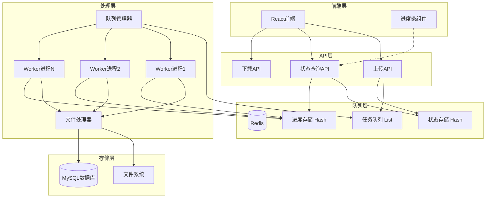
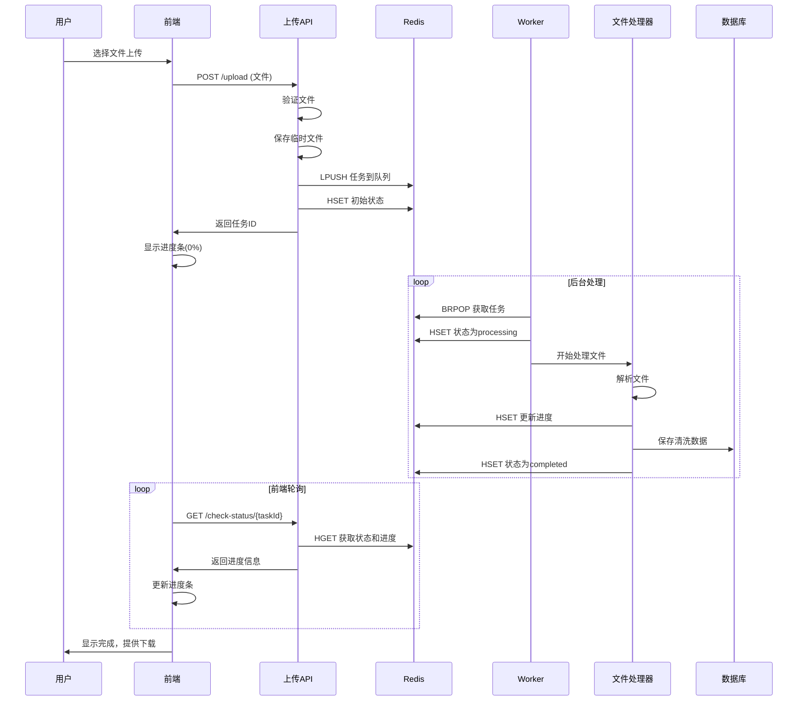

# 设计文档

## 概述

本设计文档描述了数据治理系统异步队列处理功能的技术实现方案。该系统将现有的同步文件处理架构改造为基于Redis的异步生产者-消费者模型，实现文件上传与处理的解耦，提供实时进度反馈，并显著改善用户体验。

核心设计原则：
- **解耦性**：文件上传和处理完全分离
- **可靠性**：基于Redis的持久化队列确保任务不丢失
- **可扩展性**：支持多个Worker进程并行处理
- **实时性**：提供毫秒级的进度更新
- **兼容性**：与现有系统无缝集成

## 架构

### 系统架构图



### 数据流架构



## 组件和接口

### 1. 队列管理器 (QueueManager)

负责Redis连接管理和队列操作的核心组件。

```typescript
interface QueueManager {
  // 队列操作
  enqueueTask(task: ProcessingTask): Promise<string>;
  dequeueTask(timeout?: number): Promise<ProcessingTask | null>;
  
  // 状态管理
  setTaskStatus(taskId: string, status: TaskStatus, data?: any): Promise<void>;
  getTaskStatus(taskId: string): Promise<TaskStatusInfo>;
  
  // 进度管理
  updateProgress(taskId: string, progress: ProgressInfo): Promise<void>;
  getProgress(taskId: string): Promise<ProgressInfo>;
  
  // 健康检查
  isHealthy(): Promise<boolean>;
  getQueueStats(): Promise<QueueStats>;
}

interface ProcessingTask {
  taskId: string;
  fileId: string;
  filePath: string;
  originalFileName: string;
  fileSize: number;
  createdAt: Date;
  retryCount: number;
}

interface TaskStatusInfo {
  taskId: string;
  status: TaskStatus;
  progress: number;
  createdAt: Date;
  startedAt?: Date;
  completedAt?: Date;
  errorMessage?: string;
  statistics?: ProcessingStatistics;
}

interface ProgressInfo {
  taskId: string;
  progress: number;
  processedRows: number;
  totalRows: number;
  currentPhase: string;
  estimatedTimeRemaining?: number;
}

enum TaskStatus {
  PENDING = 'pending',
  PROCESSING = 'processing',
  COMPLETED = 'completed',
  FAILED = 'failed',
  TIMEOUT = 'timeout'
}
```

### 2. 任务生产者 (TaskProducer)

集成到现有上传API中，负责创建和入队处理任务。

```typescript
@Injectable()
export class TaskProducer {
  constructor(
    private readonly queueManager: QueueManager,
    private readonly fileService: FileService,
    private readonly fileRecordService: FileRecordService
  ) {}

  async createProcessingTask(
    file: Express.Multer.File,
    fileRecord: FileRecord
  ): Promise<string> {
    // 保存临时文件
    const tempFilePath = await this.fileService.saveTemporaryFile(file);
    
    // 创建任务
    const task: ProcessingTask = {
      taskId: fileRecord.jobId,
      fileId: fileRecord.id,
      filePath: tempFilePath,
      originalFileName: file.originalname,
      fileSize: file.size,
      createdAt: new Date(),
      retryCount: 0
    };
    
    // 入队任务
    await this.queueManager.enqueueTask(task);
    
    // 设置初始状态
    await this.queueManager.setTaskStatus(task.taskId, TaskStatus.PENDING);
    
    return task.taskId;
  }
}
```

### 3. 任务消费者 (TaskConsumer)

独立的Worker进程，负责从队列获取任务并执行处理。

```typescript
@Injectable()
export class TaskConsumer {
  private isRunning = false;
  private readonly logger = new Logger(TaskConsumer.name);

  constructor(
    private readonly queueManager: QueueManager,
    private readonly fileProcessor: FileProcessor,
    private readonly progressTracker: ProgressTracker
  ) {}

  async start(): Promise<void> {
    this.isRunning = true;
    this.logger.log('任务消费者启动');
    
    while (this.isRunning) {
      try {
        // 阻塞式获取任务
        const task = await this.queueManager.dequeueTask(30); // 30秒超时
        
        if (task) {
          await this.processTask(task);
        }
      } catch (error) {
        this.logger.error('处理任务时发生错误', error);
        await this.sleep(5000); // 错误后等待5秒
      }
    }
  }

  async stop(): Promise<void> {
    this.isRunning = false;
    this.logger.log('任务消费者停止');
  }

  private async processTask(task: ProcessingTask): Promise<void> {
    const { taskId } = task;
    
    try {
      // 更新状态为处理中
      await this.queueManager.setTaskStatus(taskId, TaskStatus.PROCESSING, {
        startedAt: new Date()
      });
      
      // 开始处理文件
      const result = await this.fileProcessor.processFile(
        task,
        (progress) => this.progressTracker.updateProgress(taskId, progress)
      );
      
      // 更新为完成状态
      await this.queueManager.setTaskStatus(taskId, TaskStatus.COMPLETED, {
        completedAt: new Date(),
        statistics: result.statistics
      });
      
      this.logger.log(`任务 ${taskId} 处理完成`);
      
    } catch (error) {
      this.logger.error(`任务 ${taskId} 处理失败`, error);
      
      // 更新为失败状态
      await this.queueManager.setTaskStatus(taskId, TaskStatus.FAILED, {
        completedAt: new Date(),
        errorMessage: error.message
      });
      
      // 根据错误类型决定是否重试
      if (this.shouldRetry(error, task.retryCount)) {
        await this.scheduleRetry(task);
      }
    }
  }

  private shouldRetry(error: Error, retryCount: number): boolean {
    const maxRetries = 3;
    const retryableErrors = ['ECONNRESET', 'ETIMEDOUT', 'ENOTFOUND'];
    
    return retryCount < maxRetries && 
           retryableErrors.some(code => error.message.includes(code));
  }

  private async scheduleRetry(task: ProcessingTask): Promise<void> {
    const retryTask = {
      ...task,
      retryCount: task.retryCount + 1
    };
    
    // 延迟重试（指数退避）
    const delay = Math.pow(2, task.retryCount) * 1000;
    setTimeout(async () => {
      await this.queueManager.enqueueTask(retryTask);
    }, delay);
  }

  private sleep(ms: number): Promise<void> {
    return new Promise(resolve => setTimeout(resolve, ms));
  }
}
```

### 4. 进度跟踪器 (ProgressTracker)

管理任务进度信息的组件。

```typescript
@Injectable()
export class ProgressTracker {
  constructor(private readonly queueManager: QueueManager) {}

  async updateProgress(taskId: string, progress: Partial<ProgressInfo>): Promise<void> {
    const currentProgress = await this.queueManager.getProgress(taskId);
    
    const updatedProgress: ProgressInfo = {
      ...currentProgress,
      ...progress,
      taskId
    };
    
    // 计算预估剩余时间
    if (progress.processedRows && progress.totalRows) {
      updatedProgress.estimatedTimeRemaining = this.calculateETA(
        progress.processedRows,
        progress.totalRows,
        currentProgress?.startedAt
      );
    }
    
    await this.queueManager.updateProgress(taskId, updatedProgress);
  }

  private calculateETA(
    processedRows: number,
    totalRows: number,
    startedAt?: Date
  ): number {
    if (!startedAt || processedRows === 0) return 0;
    
    const elapsedMs = Date.now() - startedAt.getTime();
    const rowsPerMs = processedRows / elapsedMs;
    const remainingRows = totalRows - processedRows;
    
    return Math.round(remainingRows / rowsPerMs);
  }
}
```

### 5. 状态查询API

提供任务状态和进度查询的REST接口。

```typescript
@Controller('api/data-cleaning')
export class AsyncProcessingController {
  constructor(
    private readonly queueManager: QueueManager,
    private readonly taskProducer: TaskProducer
  ) {}

  @Get('check-status/:taskId')
  @ApiOperation({ summary: '查询任务状态和进度' })
  async checkStatus(@Param('taskId') taskId: string): Promise<TaskStatusResponse> {
    const statusInfo = await this.queueManager.getTaskStatus(taskId);
    const progressInfo = await this.queueManager.getProgress(taskId);
    
    return {
      taskId,
      status: statusInfo.status,
      progress: progressInfo.progress,
      processedRows: progressInfo.processedRows,
      totalRows: progressInfo.totalRows,
      currentPhase: progressInfo.currentPhase,
      estimatedTimeRemaining: progressInfo.estimatedTimeRemaining,
      statistics: statusInfo.statistics,
      createdAt: statusInfo.createdAt,
      startedAt: statusInfo.startedAt,
      completedAt: statusInfo.completedAt,
      errorMessage: statusInfo.errorMessage
    };
  }

  @Post('upload')
  @UseInterceptors(FileInterceptor('file'))
  async uploadFile(@UploadedFile() file: Express.Multer.File): Promise<UploadResponse> {
    // 验证文件
    const validation = this.fileService.validateFile(file);
    if (!validation.isValid) {
      throw new BadRequestException(validation.error);
    }

    // 创建文件记录
    const fileRecord = await this.fileRecordService.createFileRecord({
      originalFileName: file.originalname,
      fileSize: file.size,
      fileType: path.extname(file.originalname).substring(1),
      mimeType: file.mimetype,
    });

    // 创建处理任务
    const taskId = await this.taskProducer.createProcessingTask(file, fileRecord);

    return {
      taskId,
      fileId: fileRecord.id,
      message: '文件上传成功，开始处理',
      status: 'pending'
    };
  }
}
```

## 数据模型

### Redis数据结构

#### 1. 任务队列 (List)
```
Key: queue:file-processing
Type: List
Operations: LPUSH (入队), BRPOP (出队)
Data: JSON字符串格式的ProcessingTask对象
```

#### 2. 任务状态存储 (Hash)
```
Key: task:status:{taskId}
Type: Hash
Fields:
  - status: pending|processing|completed|failed|timeout
  - createdAt: ISO时间戳
  - startedAt: ISO时间戳
  - completedAt: ISO时间戳
  - errorMessage: 错误信息
  - statistics: JSON格式的处理统计信息
TTL: 7天
```

#### 3. 进度信息存储 (Hash)
```
Key: task:progress:{taskId}
Type: Hash
Fields:
  - progress: 进度百分比 (0-100)
  - processedRows: 已处理行数
  - totalRows: 总行数
  - currentPhase: 当前处理阶段
  - estimatedTimeRemaining: 预估剩余时间(毫秒)
  - lastUpdated: 最后更新时间
TTL: 7天
```

#### 4. 队列统计信息 (Hash)
```
Key: queue:stats
Type: Hash
Fields:
  - totalEnqueued: 总入队数量
  - totalProcessed: 总处理数量
  - totalFailed: 总失败数量
  - currentQueueLength: 当前队列长度
  - activeWorkers: 活跃Worker数量
```

### 数据库扩展

现有的文件记录表需要添加异步处理相关字段：

```sql
ALTER TABLE file_records ADD COLUMN task_id VARCHAR(255) UNIQUE;
ALTER TABLE file_records ADD COLUMN queue_status ENUM('pending', 'processing', 'completed', 'failed') DEFAULT 'pending';
ALTER TABLE file_records ADD COLUMN enqueued_at TIMESTAMP NULL;
ALTER TABLE file_records ADD COLUMN processing_started_at TIMESTAMP NULL;
ALTER TABLE file_records ADD INDEX idx_task_id (task_id);
ALTER TABLE file_records ADD INDEX idx_queue_status (queue_status);
```

## 正确性属性

*属性是一个特征或行为，应该在系统的所有有效执行中保持为真。属性作为人类可读规范和机器可验证正确性保证之间的桥梁。*

在编写正确性属性之前，我需要分析验收标准的可测试性：

基于预工作分析，我将把可测试的验收标准转换为正确性属性：

### 属性1：文件上传任务创建正确性
*对于任何*有效文件上传，系统应生成唯一任务ID，将任务入队，并返回可用于状态跟踪的任务标识符
**验证需求：1.1, 1.2, 1.3**

### 属性2：文件验证拒绝无效输入
*对于任何*无效文件（格式错误、过大、空文件），系统应拒绝上传并返回适当的错误消息
**验证需求：1.4**

### 属性3：队列FIFO行为正确性
*对于任何*按顺序入队的任务序列，出队顺序应严格遵循先进先出原则
**验证需求：2.1, 2.2, 2.3**

### 属性4：任务状态转换正确性
*对于任何*处理任务，状态转换应遵循 pending → processing → (completed|failed) 的正确顺序
**验证需求：1.5, 2.4, 3.4, 3.5**

### 属性5：Redis持久化和恢复
*对于任何*入队的任务，在Redis重启后任务信息应保持完整且可继续处理
**验证需求：2.5, 7.1, 7.2**

### 属性6：连接失败重试机制
*对于任何*Redis连接失败情况，系统应使用指数退避算法进行重连，直到达到最大重试次数
**验证需求：2.6, 8.1**

### 属性7：文件处理执行正确性
*对于任何*被消费的任务，文件处理器应被正确调用并执行完整的数据清洗工作流
**验证需求：3.2**

### 属性8：进度跟踪准确性
*对于任何*处理中的任务，进度百分比应准确反映已处理行数与总行数的比例
**验证需求：4.1, 4.2, 4.3, 4.4, 4.5**

### 属性9：优雅关闭任务保护
*对于任何*正在处理的任务，在消费者优雅关闭时任务应不丢失且可被其他消费者继续处理
**验证需求：3.6**

### 属性10：故障恢复机制
*对于任何*因消费者崩溃而被遗弃的"处理中"任务，系统应检测并重置为"待处理"状态
**验证需求：3.7, 7.3**

### 属性11：状态查询API正确性
*对于任何*有效任务ID的状态查询，API应返回包含状态、进度、统计信息的完整响应
**验证需求：5.1, 5.2, 5.4**

### 属性12：任务超时处理
*对于任何*超过最大处理时间的任务，系统应将其标记为"超时失败"并记录相应错误
**验证需求：7.4, 7.5**

### 属性13：错误分类和重试逻辑
*对于任何*处理失败的任务，系统应正确区分可重试错误和永久错误，并执行相应的重试或失败处理
**验证需求：8.2, 8.3, 8.4, 8.5**

### 属性14：配置参数生效性
*对于任何*修改的配置参数（Redis连接、队列参数），系统行为应相应调整并生效
**验证需求：9.1, 9.2**

### 属性15：监控指标准确性
*对于任何*队列操作，相关指标（队列长度、吞吐量、错误率）应准确反映系统当前状态
**验证需求：9.3, 9.4**

### 属性16：向后兼容性保持
*对于任何*现有文件格式和处理规则，新系统的处理结果应与原系统保持一致
**验证需求：10.1, 10.2, 10.3, 10.4, 10.5**

## 错误处理

### 错误分类

#### 1. 可重试错误
- **网络错误**：Redis连接超时、网络中断
- **临时资源不足**：内存不足、磁盘空间不足
- **外部服务暂时不可用**：数据库连接失败

#### 2. 永久错误
- **文件格式错误**：不支持的文件类型、损坏的文件
- **业务逻辑错误**：数据验证失败、规则配置错误
- **权限错误**：文件访问权限不足

### 错误处理策略

```typescript
interface ErrorHandler {
  classifyError(error: Error): ErrorType;
  shouldRetry(error: Error, retryCount: number): boolean;
  calculateRetryDelay(retryCount: number): number;
  handlePermanentFailure(task: ProcessingTask, error: Error): Promise<void>;
}

enum ErrorType {
  RETRYABLE_NETWORK = 'retryable_network',
  RETRYABLE_RESOURCE = 'retryable_resource',
  PERMANENT_FORMAT = 'permanent_format',
  PERMANENT_BUSINESS = 'permanent_business',
  PERMANENT_PERMISSION = 'permanent_permission'
}

class DefaultErrorHandler implements ErrorHandler {
  private readonly maxRetries = 3;
  private readonly baseDelay = 1000; // 1秒

  classifyError(error: Error): ErrorType {
    if (error.message.includes('ECONNRESET') || 
        error.message.includes('ETIMEDOUT')) {
      return ErrorType.RETRYABLE_NETWORK;
    }
    
    if (error.message.includes('ENOMEM') || 
        error.message.includes('ENOSPC')) {
      return ErrorType.RETRYABLE_RESOURCE;
    }
    
    if (error.message.includes('Unsupported file format') ||
        error.message.includes('File corrupted')) {
      return ErrorType.PERMANENT_FORMAT;
    }
    
    if (error.message.includes('EACCES') ||
        error.message.includes('EPERM')) {
      return ErrorType.PERMANENT_PERMISSION;
    }
    
    return ErrorType.PERMANENT_BUSINESS;
  }

  shouldRetry(error: Error, retryCount: number): boolean {
    if (retryCount >= this.maxRetries) {
      return false;
    }
    
    const errorType = this.classifyError(error);
    return errorType === ErrorType.RETRYABLE_NETWORK || 
           errorType === ErrorType.RETRYABLE_RESOURCE;
  }

  calculateRetryDelay(retryCount: number): number {
    // 指数退避：1s, 2s, 4s, 8s...
    return this.baseDelay * Math.pow(2, retryCount);
  }

  async handlePermanentFailure(task: ProcessingTask, error: Error): Promise<void> {
    // 记录详细错误信息
    const errorDetails = {
      taskId: task.taskId,
      errorType: this.classifyError(error),
      errorMessage: error.message,
      stackTrace: error.stack,
      timestamp: new Date(),
      fileInfo: {
        fileName: task.originalFileName,
        fileSize: task.fileSize,
        filePath: task.filePath
      }
    };
    
    // 存储到错误日志
    await this.logError(errorDetails);
    
    // 通知管理员（如果是系统级错误）
    if (this.isSystemError(error)) {
      await this.notifyAdministrators(errorDetails);
    }
  }

  private async logError(errorDetails: any): Promise<void> {
    // 实现错误日志记录
  }

  private async notifyAdministrators(errorDetails: any): Promise<void> {
    // 实现管理员通知
  }

  private isSystemError(error: Error): boolean {
    const errorType = this.classifyError(error);
    return errorType === ErrorType.PERMANENT_PERMISSION ||
           errorType === ErrorType.RETRYABLE_RESOURCE;
  }
}
```

### 超时处理

```typescript
interface TimeoutManager {
  startTimeout(taskId: string): void;
  clearTimeout(taskId: string): void;
  checkTimeouts(): Promise<string[]>; // 返回超时的任务ID列表
}

class DefaultTimeoutManager implements TimeoutManager {
  private readonly timeouts = new Map<string, NodeJS.Timeout>();
  private readonly taskStartTimes = new Map<string, Date>();
  private readonly maxProcessingTime = 30 * 60 * 1000; // 30分钟

  startTimeout(taskId: string): void {
    this.taskStartTimes.set(taskId, new Date());
    
    const timeout = setTimeout(async () => {
      await this.handleTimeout(taskId);
    }, this.maxProcessingTime);
    
    this.timeouts.set(taskId, timeout);
  }

  clearTimeout(taskId: string): void {
    const timeout = this.timeouts.get(taskId);
    if (timeout) {
      clearTimeout(timeout);
      this.timeouts.delete(taskId);
    }
    this.taskStartTimes.delete(taskId);
  }

  async checkTimeouts(): Promise<string[]> {
    const now = new Date();
    const timedOutTasks: string[] = [];
    
    for (const [taskId, startTime] of this.taskStartTimes.entries()) {
      const elapsed = now.getTime() - startTime.getTime();
      if (elapsed > this.maxProcessingTime) {
        timedOutTasks.push(taskId);
      }
    }
    
    return timedOutTasks;
  }

  private async handleTimeout(taskId: string): Promise<void> {
    // 标记任务为超时失败
    await this.queueManager.setTaskStatus(taskId, TaskStatus.TIMEOUT, {
      completedAt: new Date(),
      errorMessage: `Task timed out after ${this.maxProcessingTime}ms`
    });
    
    // 清理资源
    this.clearTimeout(taskId);
  }
}
```

## 测试策略

### 双重测试方法

本系统采用单元测试和基于属性的测试相结合的方法：

- **单元测试**：验证特定示例、边界情况和错误条件
- **属性测试**：验证所有输入的通用属性
- **集成测试**：验证组件间交互和端到端流程

### 单元测试重点

单元测试应专注于：
- 特定的API端点行为示例
- Redis操作的边界情况
- 错误处理的具体场景
- 配置参数的有效性验证

### 属性测试配置

- **测试库**：使用fast-check进行TypeScript属性测试
- **最小迭代次数**：每个属性测试运行100次迭代
- **测试标记格式**：**Feature: async-queue-processing, Property {number}: {property_text}**

### 属性测试实现示例

```typescript
import fc from 'fast-check';

describe('异步队列处理属性测试', () => {
  
  test('属性1：文件上传任务创建正确性', async () => {
    // Feature: async-queue-processing, Property 1: 文件上传任务创建正确性
    await fc.assert(fc.asyncProperty(
      fc.record({
        originalname: fc.string({ minLength: 1, maxLength: 255 }),
        size: fc.integer({ min: 1, max: 500 * 1024 * 1024 }),
        mimetype: fc.constantFrom(
          'text/csv',
          'application/vnd.ms-excel',
          'application/vnd.openxmlformats-officedocument.spreadsheetml.sheet'
        ),
        buffer: fc.uint8Array({ minLength: 1, maxLength: 1000 })
      }),
      async (file) => {
        const response = await uploadFile(file);
        
        // 验证返回唯一任务ID
        expect(response.taskId).toBeDefined();
        expect(typeof response.taskId).toBe('string');
        
        // 验证任务可用于状态跟踪
        const status = await getTaskStatus(response.taskId);
        expect(status.taskId).toBe(response.taskId);
        
        // 验证任务已入队
        const queueLength = await getQueueLength();
        expect(queueLength).toBeGreaterThan(0);
      }
    ), { numRuns: 100 });
  });

  test('属性3：队列FIFO行为正确性', async () => {
    // Feature: async-queue-processing, Property 3: 队列FIFO行为正确性
    await fc.assert(fc.asyncProperty(
      fc.array(fc.string(), { minLength: 2, maxLength: 10 }),
      async (taskIds) => {
        // 清空队列
        await clearQueue();
        
        // 按顺序入队
        for (const taskId of taskIds) {
          await enqueueTask({ taskId, data: `task-${taskId}` });
        }
        
        // 按顺序出队并验证
        const dequeuedIds: string[] = [];
        for (let i = 0; i < taskIds.length; i++) {
          const task = await dequeueTask();
          expect(task).toBeDefined();
          dequeuedIds.push(task.taskId);
        }
        
        // 验证FIFO顺序
        expect(dequeuedIds).toEqual(taskIds);
      }
    ), { numRuns: 100 });
  });

  test('属性8：进度跟踪准确性', async () => {
    // Feature: async-queue-processing, Property 8: 进度跟踪准确性
    await fc.assert(fc.asyncProperty(
      fc.record({
        totalRows: fc.integer({ min: 100, max: 10000 }),
        processedRows: fc.integer({ min: 0, max: 10000 })
      }).filter(({ totalRows, processedRows }) => processedRows <= totalRows),
      async ({ totalRows, processedRows }) => {
        const taskId = generateTaskId();
        
        // 更新进度
        await updateProgress(taskId, {
          totalRows,
          processedRows,
          currentPhase: 'processing'
        });
        
        // 获取进度信息
        const progress = await getProgress(taskId);
        
        // 验证进度计算准确性
        const expectedProgress = Math.round((processedRows / totalRows) * 100);
        expect(progress.progress).toBe(expectedProgress);
        expect(progress.processedRows).toBe(processedRows);
        expect(progress.totalRows).toBe(totalRows);
      }
    ), { numRuns: 100 });
  });
});
```

### 集成测试策略

集成测试应覆盖：
- 完整的文件上传到处理完成流程
- Redis故障和恢复场景
- 多Worker并发处理
- 系统重启后的任务恢复
- 前后端API集成

### 性能测试

- **负载测试**：模拟大量并发文件上传
- **压力测试**：测试系统在极限负载下的表现
- **容量测试**：确定系统的最大处理能力
- **稳定性测试**：长时间运行验证系统稳定性

### 测试环境配置

```typescript
// 测试配置
export const testConfig = {
  redis: {
    host: 'localhost',
    port: 6379,
    db: 15, // 使用专用测试数据库
  },
  queue: {
    maxRetries: 2,
    timeoutMs: 5000, // 测试环境使用较短超时
    workerCount: 2,
  },
  files: {
    maxSize: 10 * 1024 * 1024, // 10MB for tests
    tempDir: './test-temp',
  }
};

// 测试辅助函数
export class TestHelper {
  static async clearRedis(): Promise<void> {
    const redis = new Redis(testConfig.redis);
    await redis.flushdb();
    await redis.quit();
  }

  static async createTestFile(size: number, format: string): Promise<Buffer> {
    // 生成测试文件内容
  }

  static async waitForTaskCompletion(taskId: string, timeoutMs = 10000): Promise<void> {
    const startTime = Date.now();
    while (Date.now() - startTime < timeoutMs) {
      const status = await getTaskStatus(taskId);
      if (status.status === 'completed' || status.status === 'failed') {
        return;
      }
      await new Promise(resolve => setTimeout(resolve, 100));
    }
    throw new Error(`Task ${taskId} did not complete within ${timeoutMs}ms`);
  }
}
```