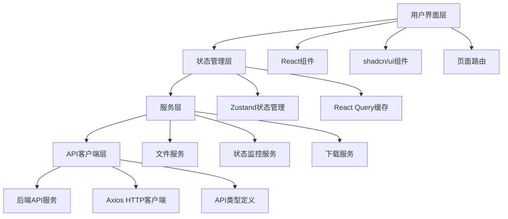

# 设计文档

## 概述

数据清洗服务前端应用是一个基于 React 和 TypeScript 构建的现代化 Web 应用，使用 shadcn/ui 组件库提供简洁美观的用户界面。应用通过 RESTful API 与后端数据清洗服务通信，为用户提供文件上传、处理监控、文件管理和数据下载等功能。

## 架构

### 整体架构



### 技术栈

- **前端框架**: React 18 + TypeScript
- **构建工具**: Vite
- **UI组件库**: shadcn/ui (基于 Radix UI 和 Tailwind CSS)
- **状态管理**: Zustand
- **数据获取**: React Query (TanStack Query)
- **HTTP客户端**: Axios
- **路由**: React Router
- **样式**: Tailwind CSS
- **图标**: Lucide React

## 组件和接口

### 页面组件

#### 1. 主页组件 (HomePage)
```typescript
interface HomePageProps {}

interface ServiceInfo {
  name: string;
  description: string;
  purpose: string;
  features: string[];
}
```

#### 2. 文件上传页面 (UploadPage)
```typescript
interface UploadPageProps {}

interface UploadState {
  isUploading: boolean;
  progress: number;
  error: string | null;
}
```

#### 3. 文件列表页面 (FilesPage)
```typescript
interface FilesPageProps {}

interface FileListState {
  files: FileRecord[];
  loading: boolean;
  pagination: PaginationInfo;
  filters: FileFilters;
}
```

#### 4. 文件详情页面 (FileDetailPage)
```typescript
interface FileDetailPageProps {
  fileId: string;
}

interface FileDetailState {
  file: FileDetail | null;
  loading: boolean;
  error: string | null;
}
```

### 核心组件

#### 1. 文件上传组件 (FileUploadComponent)
```typescript
interface FileUploadComponentProps {
  onUploadSuccess: (response: UploadResponse) => void;
  onUploadError: (error: string) => void;
}

interface FileUploadState {
  selectedFile: File | null;
  isDragOver: boolean;
  isUploading: boolean;
  progress: number;
}
```

#### 2. 状态监控组件 (StatusMonitor)
```typescript
interface StatusMonitorProps {
  jobId: string;
  onStatusChange: (status: JobStatus) => void;
}

interface JobStatus {
  jobId: string;
  status: 'processing' | 'completed' | 'failed';
  progress: number;
  statistics?: ProcessingStatistics;
}
```

#### 3. 文件列表组件 (FileList)
```typescript
interface FileListProps {
  files: FileRecord[];
  loading: boolean;
  onFileSelect: (fileId: string) => void;
}

interface FileRecord {
  id: string;
  jobId: string;
  originalFileName: string;
  fileSize: number;
  status: FileStatus;
  uploadedAt: string;
  completedAt?: string;
  totalRows?: number;
  cleanedRows?: number;
  exceptionRows?: number;
}
```

#### 4. 下载管理组件 (DownloadManager)
```typescript
interface DownloadManagerProps {
  jobId: string;
  status: JobStatus;
}

interface DownloadOptions {
  cleanData: boolean;
  exceptionData: boolean;
}
```

### 服务接口

#### 1. API客户端服务 (ApiClient)
```typescript
interface ApiClient {
  uploadFile(file: File): Promise<UploadResponse>;
  getJobStatus(jobId: string): Promise<StatusResponse>;
  getFileList(params: FileListParams): Promise<FileListResponse>;
  getFileDetail(fileId: string): Promise<FileDetailResponse>;
  downloadCleanData(jobId: string): Promise<Blob>;
  downloadExceptionData(jobId: string): Promise<Blob>;
}

interface FileListParams {
  page?: number;
  pageSize?: number;
  status?: FileStatus;
  startDate?: string;
  endDate?: string;
}
```

#### 2. 文件服务 (FileService)
```typescript
interface FileService {
  validateFile(file: File): ValidationResult;
  formatFileSize(bytes: number): string;
  getFileExtension(filename: string): string;
}

interface ValidationResult {
  isValid: boolean;
  error?: string;
}
```

#### 3. 通知服务 (NotificationService)
```typescript
interface NotificationService {
  showSuccess(message: string): void;
  showError(message: string): void;
  showInfo(message: string): void;
  showWarning(message: string): void;
}
```

## 数据模型

### API响应类型

```typescript
// 上传响应
interface UploadResponse {
  jobId: string;
  fileId: string;
  message: string;
  totalRows: number;
}

// 状态响应
interface StatusResponse {
  jobId: string;
  status: 'processing' | 'completed' | 'failed';
  progress: number;
  statistics?: ProcessingStatistics;
}

// 处理统计
interface ProcessingStatistics {
  totalRows: number;
  cleanedRows: number;
  exceptionRows: number;
  processingTime: number;
}

// 文件列表响应
interface FileListResponse {
  files: FileRecord[];
  total: number;
  page: number;
  pageSize: number;
}

// 文件详情响应
interface FileDetailResponse {
  file: FileDetail;
  statistics?: ProcessingStatistics;
}

// 文件详情
interface FileDetail extends FileRecord {
  mimeType: string;
  processingTime?: number;
  errorMessage?: string;
}

// 错误响应
interface ErrorResponse {
  statusCode: number;
  errorCode: string;
  message: string;
  details?: any;
  timestamp: string;
}
```

### 应用状态类型

```typescript
// 文件状态枚举
type FileStatus = 'pending' | 'processing' | 'completed' | 'failed';

// 分页信息
interface PaginationInfo {
  page: number;
  pageSize: number;
  total: number;
  totalPages: number;
}

// 文件筛选
interface FileFilters {
  status?: FileStatus;
  startDate?: string;
  endDate?: string;
}

// 应用主题
interface AppTheme {
  mode: 'light' | 'dark';
  primaryColor: string;
}
```

## 正确性属性

*属性是一个特征或行为，应该在系统的所有有效执行中保持为真——本质上是关于系统应该做什么的正式声明。属性作为人类可读规范和机器可验证正确性保证之间的桥梁。*

现在我需要使用 prework 工具来分析验收标准的可测试性：

基于预工作分析，我将验收标准转换为可测试的正确性属性：

### 属性 1: 首页服务信息显示
*对于任何* 首页访问请求，页面应该显示完整的服务信息，包括服务名称"数据清洗服务"、服务描述"专业的Excel数据清洗和标准化服务"、服务用途说明和服务目的价值
**验证需求：需求 1.1, 1.2, 1.3, 1.4**

### 属性 2: 文件上传验证
*对于任何* 文件选择操作，文件上传组件应该正确验证文件格式（只接受.xlsx和.xls）和文件大小（拒绝超过10MB的文件）
**验证需求：需求 2.1, 2.2**

### 属性 3: 上传响应处理
*对于任何* 文件上传操作，系统应该根据上传结果正确处理响应：成功时显示任务ID、文件ID、成功消息和总行数；失败时显示具体错误信息
**验证需求：需求 2.3, 2.4, 2.5**

### 属性 4: 状态监控显示
*对于任何* 任务状态查询，状态监控组件应该根据状态正确显示内容：processing时显示进度条和百分比，completed时显示统计信息，failed时显示错误信息
**验证需求：需求 3.1, 3.2, 3.3, 3.4**

### 属性 5: API错误处理
*对于任何* 不存在的资源请求（任务ID或文件ID），API客户端应该返回404错误
**验证需求：需求 3.5, 5.4**

### 属性 6: 文件列表管理
*对于任何* 文件列表请求，文件管理器应该正确处理分页显示、状态筛选、日期范围筛选，并在点击文件时显示详情
**验证需求：需求 4.1, 4.2, 4.3, 4.4**

### 属性 7: 文件详情显示
*对于任何* 文件详情请求，系统应该根据文件状态正确显示信息：基本信息总是显示，completed状态显示统计数据，failed状态显示错误信息
**验证需求：需求 5.1, 5.2, 5.3**

### 属性 8: 下载功能管理
*对于任何* 已完成处理的任务，下载管理器应该提供清洁数据下载按钮，当存在异常数据时提供异常数据下载按钮，下载成功时显示成功提示
**验证需求：需求 6.1, 6.2, 6.3, 6.5**

### 属性 9: 下载API错误处理
*对于任何* 不可下载的文件请求（文件不存在或处理未完成），API客户端应该返回404错误
**验证需求：需求 6.4**

### 属性 10: 错误处理和用户反馈
*对于任何* 系统操作，应用应该提供适当的用户反馈：API失败时显示友好错误消息，网络错误时显示网络错误提示，服务器错误时解析并显示具体信息，操作成功时显示成功消息，数据加载时显示加载指示器
**验证需求：需求 7.1, 7.2, 7.3, 7.4, 7.5**

## 错误处理

### 错误类型和处理策略

1. **网络错误**
   - 连接超时：显示"网络连接超时，请检查网络设置"
   - 网络中断：显示"网络连接中断，请检查网络连接"
   - 服务器不可达：显示"服务器暂时不可用，请稍后重试"

2. **API错误**
   - 400 Bad Request：解析错误详情并显示具体问题
   - 404 Not Found：显示"请求的资源不存在"
   - 500 Internal Server Error：显示"服务器内部错误，请稍后重试"

3. **文件上传错误**
   - 文件格式不支持：显示"请上传Excel文件（.xlsx或.xls格式）"
   - 文件过大：显示"文件大小不能超过10MB"
   - 文件损坏：显示"文件损坏或格式错误，请检查文件"

4. **业务逻辑错误**
   - 任务不存在：显示"任务不存在或已过期"
   - 处理失败：显示具体的处理失败原因
   - 下载失败：显示"文件下载失败，请稍后重试"

### 错误恢复机制

- **自动重试**：网络错误和临时服务器错误自动重试3次
- **用户重试**：提供重试按钮让用户手动重试失败的操作
- **错误日志**：记录错误信息用于调试和监控
- **优雅降级**：在部分功能不可用时保持其他功能正常工作

## 测试策略

### 双重测试方法

我们将采用单元测试和属性测试相结合的方法来确保全面的测试覆盖：

#### 单元测试
- **特定示例验证**：测试具体的用例和边界条件
- **组件集成测试**：验证组件之间的交互
- **错误条件测试**：测试各种错误场景的处理
- **用户交互测试**：测试用户操作的响应

#### 属性测试
- **通用属性验证**：通过随机化输入验证通用属性
- **全面输入覆盖**：测试大量不同的输入组合
- **不变量验证**：确保系统不变量在所有操作中保持

### 测试框架和工具

- **测试框架**：Jest + React Testing Library
- **属性测试库**：fast-check
- **E2E测试**：Playwright
- **API模拟**：MSW (Mock Service Worker)
- **测试覆盖率**：Istanbul

### 属性测试配置

- **最小迭代次数**：每个属性测试运行100次迭代
- **测试标记格式**：**Feature: data-cleaning-frontend, Property {number}: {property_text}**
- **需求追溯**：每个属性测试必须引用其对应的设计文档属性

### 测试重点

1. **文件验证逻辑**：确保文件类型和大小验证的正确性
2. **API交互**：验证所有API调用的正确性和错误处理
3. **状态管理**：确保应用状态的一致性和正确更新
4. **用户界面**：验证UI组件的正确渲染和交互
5. **错误处理**：确保所有错误场景都有适当的处理和用户反馈

通过这种综合的测试策略，我们可以确保数据清洗前端应用的可靠性和用户