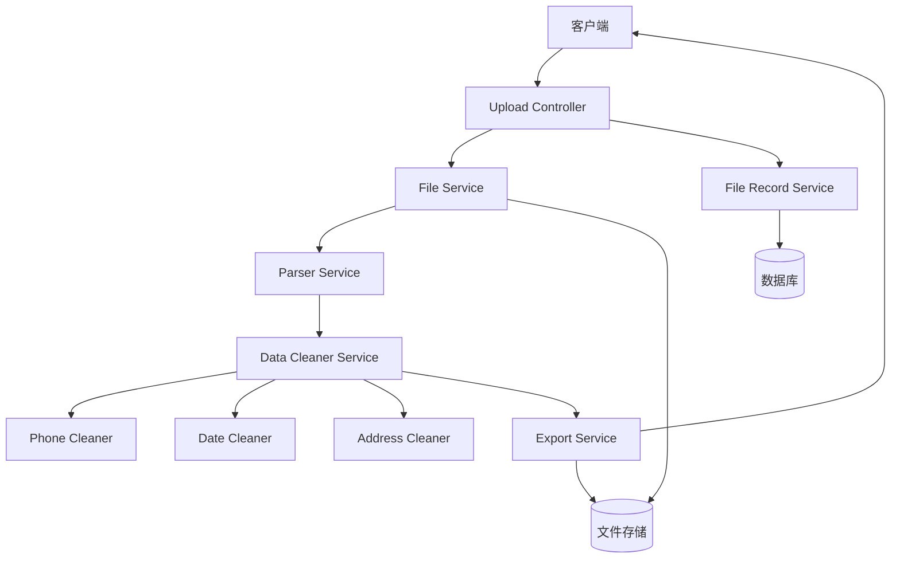
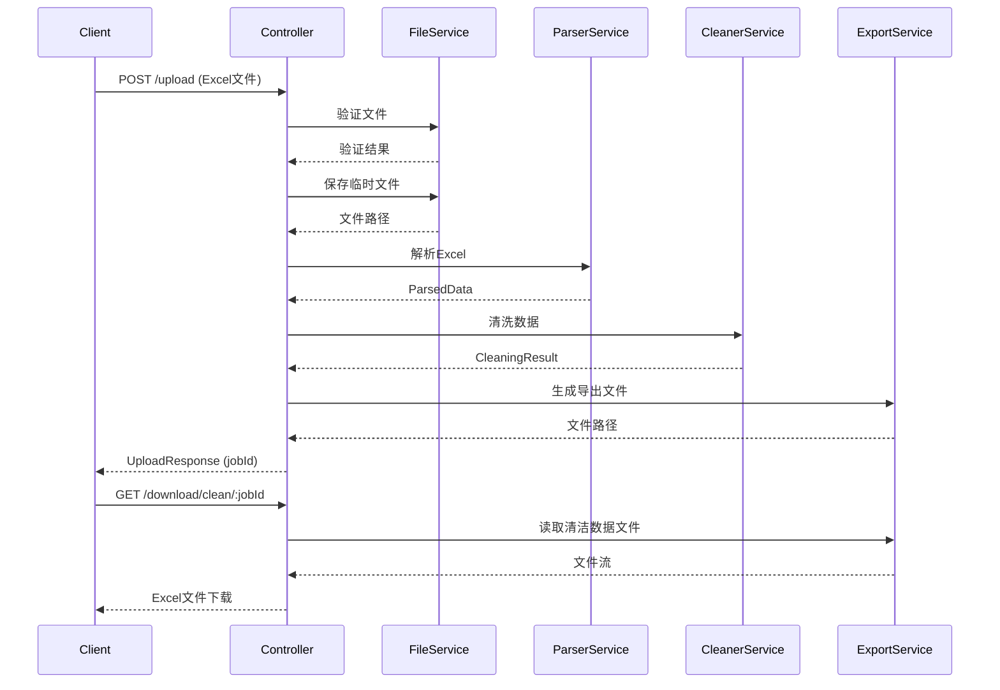

# 设计文档

## 概述

数据清洗服务是一个基于NestJS框架的RESTful API服务，用于处理Excel文件中的脏数据。系统采用模块化架构，将文件上传、数据解析、数据清洗、数据验证和文件导出等功能分离为独立的模块，确保代码的可维护性和可扩展性。

核心技术栈：
- **NestJS**: 后端框架，提供依赖注入和模块化架构
- **Multer**: 处理multipart/form-data文件上传
- **xlsx (SheetJS)**: Excel文件解析和生成
- **class-validator**: 数据验证
- **TypeORM**: ORM框架，用于数据库操作
- **MySQL/PostgreSQL**: 关系型数据库，存储文件元数据和处理记录
- **address-parse** 或自定义正则: 中国地址解析

## 架构

### 系统架构图



### 模块划分

1. **Upload Module**: 处理文件上传和验证
2. **Parser Module**: 解析Excel文件内容
3. **Cleaner Module**: 数据清洗核心逻辑
4. **Export Module**: 生成和导出处理后的文件
5. **File Record Module**: 管理文件记录和数据库操作
6. **Common Module**: 共享工具和类型定义

## 组件和接口

### 1. Upload Controller

负责接收HTTP请求并协调各个服务。

```typescript
@Controller('api/data-cleaning')
export class DataCleaningController {
  // 上传Excel文件
  @Post('upload')
  @UseInterceptors(FileInterceptor('file'))
  async uploadFile(@UploadedFile() file: Express.Multer.File): Promise<UploadResponse>
  
  // 获取处理状态
  @Get('status/:jobId')
  async getStatus(@Param('jobId') jobId: string): Promise<StatusResponse>
  
  // 查询所有文件记录
  @Get('files')
  async listFiles(@Query() query: ListFilesDto): Promise<FileListResponse>
  
  // 查询单个文件记录详情
  @Get('files/:fileId')
  async getFileDetail(@Param('fileId') fileId: string): Promise<FileDetailResponse>
  
  // 下载清洁数据
  @Get('download/clean/:jobId')
  async downloadClean(@Param('jobId') jobId: string, @Res() res: Response): Promise<void>
  
  // 下载异常数据
  @Get('download/exceptions/:jobId')
  async downloadExceptions(@Param('jobId') jobId: string, @Res() res: Response): Promise<void>
}
```

### 2. File Service

处理文件上传、验证和临时存储。

```typescript
@Injectable()
export class FileService {
  // 验证文件类型和大小
  validateFile(file: Express.Multer.File): ValidationResult
  
  // 保存上传的文件到临时目录
  saveTemporaryFile(file: Express.Multer.File): Promise<string>
  
  // 清理临时文件
  cleanupFile(filePath: string): Promise<void>
}
```

**文件验证规则**:
- 允许的MIME类型: `application/vnd.openxmlformats-officedocument.spreadsheetml.sheet`, `application/vnd.ms-excel`
- 允许的扩展名: `.xlsx`, `.xls`
- 最大文件大小: 10MB

### 3. Parser Service

解析Excel文件内容为JSON格式。

```typescript
@Injectable()
export class ParserService {
  // 解析Excel文件
  parseExcelFile(filePath: string): Promise<ParsedData>
  
  // 识别列类型（手机号、日期、地址等）
  identifyColumnTypes(headers: string[], sampleData: any[]): ColumnTypeMap
  
  // 将工作表转换为JSON
  sheetToJson(sheet: WorkSheet): any[]
}
```

**ParsedData 结构**:
```typescript
interface ParsedData {
  sheets: SheetData[];
  totalRows: number;
}

interface SheetData {
  name: string;
  headers: string[];
  rows: RowData[];
  columnTypes: ColumnTypeMap;
}

interface RowData {
  rowNumber: number;
  data: Record<string, any>;
}

type ColumnTypeMap = Record<string, 'phone' | 'date' | 'address' | 'text' | 'number'>;
```

### 4. Data Cleaner Service

协调各个清洗器处理数据。

```typescript
@Injectable()
export class DataCleanerService {
  constructor(
    private phoneCleaner: PhoneCleanerService,
    private dateCleaner: DateCleanerService,
    private addressCleaner: AddressCleanerService,
  ) {}
  
  // 处理所有数据
  async cleanData(parsedData: ParsedData): Promise<CleaningResult>
  
  // 处理单行数据
  cleanRow(row: RowData, columnTypes: ColumnTypeMap): CleanedRow
}
```

**CleaningResult 结构**:
```typescript
interface CleaningResult {
  jobId: string;
  cleanData: CleanedRow[];
  exceptionData: ExceptionRow[];
  statistics: Statistics;
}

interface CleanedRow {
  rowNumber: number;
  originalData: Record<string, any>;
  cleanedData: Record<string, any>;
}

interface ExceptionRow {
  rowNumber: number;
  originalData: Record<string, any>;
  errors: FieldError[];
}

interface FieldError {
  field: string;
  originalValue: any;
  errorType: string;
  errorMessage: string;
}

interface Statistics {
  totalRows: number;
  cleanedRows: number;
  exceptionRows: number;
  processingTime: number;
}
```

### 5. Phone Cleaner Service

清洗手机号数据。

```typescript
@Injectable()
export class PhoneCleanerService {
  // 清洗手机号
  cleanPhone(phone: any): CleanResult<string>
  
  // 验证手机号有效性
  private validatePhone(phone: string): boolean
}
```

**清洗规则**:
1. 移除所有空格字符
2. 移除所有横杠 `-`
3. 移除其他非数字字符（保留 `+` 如果在开头）
4. 验证长度：中国手机号11位，固定电话7-8位，带区号10-12位
5. 验证格式：手机号以1开头，第二位为3-9

### 6. Date Cleaner Service

标准化日期格式。

```typescript
@Injectable()
export class DateCleanerService {
  // 清洗日期
  cleanDate(date: any): CleanResult<string>
  
  // 解析各种日期格式
  private parseDate(dateStr: string): Date | null
  
  // 格式化为YYYY-MM-DD
  private formatDate(date: Date): string
}
```

**支持的日期格式**:
- ISO格式: `2024-01-15`, `2024/01/15`
- 中文格式: `2024年1月15日`, `2024年01月15日`
- 美式格式: `01/15/2024`, `01-15-2024`
- Excel序列号格式
- 时间戳格式

**验证规则**:
- 年份范围: 1900-2100
- 月份范围: 1-12
- 日期范围: 根据月份验证

### 7. Address Cleaner Service

从地址文本中提取省市区。

```typescript
@Injectable()
export class AddressCleanerService {
  // 清洗地址
  cleanAddress(address: any): CleanResult<AddressComponents>
  
  // 提取省市区
  private extractComponents(address: string): AddressComponents | null
  
  // 使用正则匹配省市区
  private matchProvinceCity(address: string): Partial<AddressComponents>
}
```

**AddressComponents 结构**:
```typescript
interface AddressComponents {
  province: string;
  city: string;
  district: string;
  detail?: string;
}
```

**提取策略**:
1. 使用正则表达式匹配常见省市区关键词
2. 省份匹配: `XX省`, `XX市`（直辖市）, `XX自治区`, `XX特别行政区`
3. 城市匹配: `XX市`, `XX地区`, `XX州`, `XX盟`
4. 区县匹配: `XX区`, `XX县`, `XX市`（县级市）
5. 处理特殊情况: 直辖市、自治区、特别行政区

**省市区数据源**:
- 使用内置的中国行政区划数据
- 支持模糊匹配和别名识别

### 8. Export Service

生成Excel文件供下载。

```typescript
@Injectable()
export class ExportService {
  // 导出清洁数据
  exportCleanData(cleanData: CleanedRow[]): Promise<string>
  
  // 导出异常数据
  exportExceptionData(exceptionData: ExceptionRow[]): Promise<string>
  
  // 生成Excel文件
  private generateExcel(data: any[], headers: string[]): Promise<Buffer>
}
```

**导出格式**:

清洁数据Excel结构:
- 包含所有清洗后的字段
- 保持原始列顺序
- 对于地址字段，拆分为: 省、市、区、详细地址

异常数据Excel结构:
- 包含所有原始数据
- 添加"异常原因"列，说明每个字段的错误
- 添加"行号"列，标识原文件中的位置

### 9. Common Types

```typescript
// 清洗结果通用类型
interface CleanResult<T> {
  success: boolean;
  value?: T;
  error?: string;
}

// API响应类型
interface UploadResponse {
  jobId: string;
  fileId: string;
  message: string;
  totalRows: number;
}

interface StatusResponse {
  jobId: string;
  status: 'processing' | 'completed' | 'failed';
  progress: number;
  statistics?: Statistics;
}

interface FileListResponse {
  files: FileRecord[];
  total: number;
  page: number;
  pageSize: number;
}

interface FileDetailResponse {
  file: FileRecord;
  statistics?: Statistics;
}

interface ListFilesDto {
  page?: number;
  pageSize?: number;
  status?: 'processing' | 'completed' | 'failed';
  startDate?: string;
  endDate?: string;
}
```

### 10. File Record Service

管理文件记录的数据库操作。

```typescript
@Injectable()
export class FileRecordService {
  // 创建文件记录
  createFileRecord(data: CreateFileRecordDto): Promise<FileRecord>
  
  // 更新文件记录状态
  updateFileStatus(fileId: string, status: FileStatus, statistics?: Statistics): Promise<FileRecord>
  
  // 查询文件记录列表
  listFileRecords(query: ListFilesDto): Promise<{ files: FileRecord[]; total: number }>
  
  // 查询单个文件记录
  getFileRecord(fileId: string): Promise<FileRecord>
  
  // 删除过期文件记录
  deleteExpiredRecords(daysOld: number): Promise<number>
}
```

## 数据模型

### File Record Entity

存储文件上传和处理记录的数据库实体。

```typescript
@Entity('file_records')
export class FileRecord {
  @PrimaryGeneratedColumn('uuid')
  id: string;

  @Column()
  jobId: string;

  @Column()
  originalFileName: string;

  @Column()
  fileSize: number;

  @Column()
  fileType: string; // 'xlsx' | 'xls'

  @Column()
  mimeType: string;

  @Column({ type: 'enum', enum: ['pending', 'processing', 'completed', 'failed'] })
  status: 'pending' | 'processing' | 'completed' | 'failed';

  @Column({ type: 'timestamp', default: () => 'CURRENT_TIMESTAMP' })
  uploadedAt: Date;

  @Column({ type: 'timestamp', nullable: true })
  completedAt: Date;

  @Column({ type: 'int', nullable: true })
  totalRows: number;

  @Column({ type: 'int', nullable: true })
  cleanedRows: number;

  @Column({ type: 'int', nullable: true })
  exceptionRows: number;

  @Column({ type: 'int', nullable: true })
  processingTime: number; // 毫秒

  @Column({ nullable: true })
  cleanDataPath: string;

  @Column({ nullable: true })
  exceptionDataPath: string;

  @Column({ type: 'text', nullable: true })
  errorMessage: string;

  @CreateDateColumn()
  createdAt: Date;

  @UpdateDateColumn()
  updatedAt: Date;
}
```

### 数据库索引

```typescript
// 为常用查询字段添加索引
@Index(['status'])
@Index(['uploadedAt'])
@Index(['jobId'])
@Entity('file_records')
export class FileRecord {
  // ... 字段定义
}
```

### 数据流



## 正确性属性

*属性是关于系统应该做什么的特征或行为，它应该在系统的所有有效执行中保持为真。属性是人类可读规范和机器可验证正确性保证之间的桥梁。*


### 属性 1: 有效Excel文件接受
*对于任何*有效的Excel文件（.xlsx或.xls格式），上传后系统应当成功存储并返回有效的jobId
**验证需求: 1.1, 1.4**

### 属性 2: 无效文件拒绝
*对于任何*非Excel格式的文件，系统应当拒绝上传并返回明确的错误信息
**验证需求: 1.2**

### 属性 3: 文件大小限制
*对于任何*超过大小限制的文件，系统应当拒绝上传并返回相应提示
**验证需求: 1.3**

### 属性 4: Excel解析完整性
*对于任何*有效的Excel文件，解析后的数据行数应当等于原文件的数据行数（排除表头）
**验证需求: 2.1**

### 属性 5: 多工作表处理
*对于任何*包含多个工作表的Excel文件，系统应当处理所有工作表，解析后的工作表数量应当等于原文件的工作表数量
**验证需求: 2.2**

### 属性 6: 字段类型识别
*对于任何*包含手机号、日期或地址数据的列，系统应当正确识别其类型
**验证需求: 2.4**

### 属性 7: 手机号字符清洗
*对于任何*包含空格、横杠或其他非数字字符的手机号字符串，清洗后应当只包含纯数字字符（可能保留开头的+号）
**验证需求: 3.1, 3.2, 3.3**

### 属性 8: 手机号长度验证
*对于任何*清洗后的手机号，如果其长度不在有效范围内（中国手机号11位，固定电话7-12位），应当被标记为异常数据
**验证需求: 3.4**

### 属性 9: 日期格式标准化
*对于任何*有效的日期字符串（包括ISO格式、中文格式、美式格式等），清洗后应当统一转换为YYYY-MM-DD格式
**验证需求: 4.1, 4.2**

### 属性 10: 无效日期标记
*对于任何*无法识别或超出合理范围（1900-2100）的日期字符串，应当被标记为异常数据
**验证需求: 4.3, 4.5**

### 属性 11: 地址解析提取
*对于任何*包含完整省市区信息的地址字符串（无论文本长度），系统应当正确提取并返回省、市、区三个独立字段
**验证需求: 5.1, 5.2, 5.5**

### 属性 12: 无效地址标记
*对于任何*不完整或无法识别省市区的地址字符串，应当被标记为异常数据
**验证需求: 5.3**

### 属性 13: 清洁数据导出结构保持
*对于任何*处理完成的数据集，导出的Excel文件应当保持原有的字段顺序和数据结构
**验证需求: 6.2**

### 属性 14: 导出文件有效性
*对于任何*导出请求（清洁数据或异常数据），系统应当返回有效的Excel文件流或下载链接
**验证需求: 6.3**

### 属性 15: 异常数据完整性
*对于任何*导出的异常数据，每一行应当包含原始数据和明确的异常原因说明，标明具体哪些字段存在问题
**验证需求: 7.2, 7.3**

### 属性 16: 统计报告完整性
*对于任何*处理完成的任务，统计报告应当包含总行数、成功处理行数、异常行数，且三者之和应当等于总行数
**验证需求: 8.2, 8.3**

### 属性 17: 状态查询有效性
*对于任何*有效的jobId，状态查询应当返回当前处理阶段和进度百分比（0-100）
**验证需求: 9.4**

### 属性 18: 文件列表查询完整性
*对于任何*文件列表查询请求，返回的每条记录应当包含文件名称、文件大小、文件类型、上传时间、文件ID等必需信息
**验证需求: 8.3**

### 属性 19: 文件列表筛选正确性
*对于任何*带有状态或日期范围筛选条件的查询，返回的所有记录应当满足筛选条件
**验证需求: 8.2**

### 属性 20: 文件详情查询有效性
*对于任何*有效的文件ID，详情查询应当返回完整的文件信息和处理统计数据（如果处理已完成）
**验证需求: 8.4**

## 错误处理

### 错误类型

1. **文件上传错误**
   - 文件类型不支持: `UNSUPPORTED_FILE_TYPE`
   - 文件大小超限: `FILE_SIZE_EXCEEDED`
   - 文件上传失败: `UPLOAD_FAILED`

2. **文件解析错误**
   - Excel文件损坏: `CORRUPTED_FILE`
   - Excel文件为空: `EMPTY_FILE`
   - 解析失败: `PARSE_FAILED`

3. **数据清洗错误**
   - 字段类型识别失败: `TYPE_IDENTIFICATION_FAILED`
   - 数据清洗失败: `CLEANING_FAILED`

4. **文件导出错误**
   - 导出文件生成失败: `EXPORT_FAILED`
   - 文件不存在: `FILE_NOT_FOUND`

5. **任务状态错误**
   - 任务不存在: `JOB_NOT_FOUND`
   - 任务已过期: `JOB_EXPIRED`

6. **数据库错误**
   - 记录不存在: `RECORD_NOT_FOUND`
   - 数据库操作失败: `DATABASE_ERROR`

### 错误响应格式

```typescript
interface ErrorResponse {
  statusCode: number;
  errorCode: string;
  message: string;
  details?: any;
  timestamp: string;
}
```

### 异常处理策略

1. **全局异常过滤器**: 捕获所有未处理的异常，返回统一格式的错误响应
2. **业务异常**: 使用自定义异常类，包含错误码和详细信息
3. **验证异常**: 使用class-validator的验证管道，自动验证DTO
4. **日志记录**: 所有错误都应记录到日志系统，包含请求上下文

## 测试策略

### 双重测试方法

本项目采用单元测试和基于属性的测试相结合的方法，以确保全面的代码覆盖和正确性验证。

**单元测试**:
- 验证特定示例和边界情况
- 测试错误条件和异常处理
- 测试组件之间的集成点
- 使用Jest测试框架

**基于属性的测试**:
- 验证通用属性在所有输入中都成立
- 通过随机化实现全面的输入覆盖
- 每个属性测试最少运行100次迭代
- 使用fast-check库进行属性测试

### 测试配置

**属性测试标签格式**:
```typescript
// Feature: data-cleaning-service, Property 7: 手机号字符清洗
it('should remove all non-digit characters from phone numbers', () => {
  fc.assert(
    fc.property(fc.phoneNumberArbitrary(), (phone) => {
      const cleaned = phoneCleaner.cleanPhone(phone);
      expect(cleaned.value).toMatch(/^\+?\d+$/);
    }),
    { numRuns: 100 }
  );
});
```

### 测试覆盖范围

1. **文件上传测试**
   - 单元测试: 测试特定文件类型（.xlsx, .xls, .pdf, .txt）
   - 属性测试: 属性2（无效文件拒绝）、属性3（文件大小限制）

2. **Excel解析测试**
   - 单元测试: 测试空文件、单工作表、多工作表
   - 属性测试: 属性4（解析完整性）、属性5（多工作表处理）

3. **手机号清洗测试**
   - 单元测试: 测试特定格式（"138 1234 5678", "138-1234-5678"）
   - 属性测试: 属性7（字符清洗）、属性8（长度验证）

4. **日期清洗测试**
   - 单元测试: 测试特定格式（"2024-01-15", "2024年1月15日"）
   - 属性测试: 属性9（格式标准化）、属性10（无效日期标记）

5. **地址清洗测试**
   - 单元测试: 测试特定地址（"北京市朝阳区", "广东省广州市天河区"）
   - 属性测试: 属性11（地址解析）、属性12（无效地址标记）

6. **导出测试**
   - 单元测试: 测试空数据导出、单行数据导出
   - 属性测试: 属性13（结构保持）、属性14（文件有效性）、属性15（异常数据完整性）

7. **统计测试**
   - 单元测试: 测试特定数据集的统计
   - 属性测试: 属性16（统计报告完整性）

8. **文件记录查询测试**
   - 单元测试: 测试空列表、单条记录、分页
   - 属性测试: 属性18（文件列表完整性）、属性19（筛选正确性）、属性20（详情查询有效性）

### 测试数据生成器

使用fast-check创建自定义生成器：

```typescript
// 手机号生成器
const phoneNumberArbitrary = () => fc.string().map(s => {
  const digits = '13812345678';
  const chars = [' ', '-', '(', ')', '.'];
  // 在数字之间随机插入字符
  return insertRandomChars(digits, chars);
});

// 日期字符串生成器
const dateStringArbitrary = () => fc.date().map(d => {
  const formats = [
    d.toISOString().split('T')[0],
    `${d.getFullYear()}年${d.getMonth()+1}月${d.getDate()}日`,
    `${d.getMonth()+1}/${d.getDate()}/${d.getFullYear()}`,
  ];
  return fc.constantFrom(...formats);
});

// 地址生成器
const addressArbitrary = () => {
  const provinces = ['北京市', '广东省', '浙江省', '上海市'];
  const cities = ['朝阳区', '广州市', '杭州市', '浦东新区'];
  const districts = ['三里屯街道', '天河区', '西湖区', '陆家嘴'];
  return fc.tuple(
    fc.constantFrom(...provinces),
    fc.constantFrom(...cities),
    fc.constantFrom(...districts),
    fc.string()
  ).map(([p, c, d, detail]) => `${p}${c}${d}${detail}`);
};
```

### 集成测试

- 测试完整的数据处理流程：上传 → 解析 → 清洗 → 导出
- 使用真实的Excel文件样本
- 验证端到端的数据完整性

### 性能测试

- 测试大文件处理（接近10MB限制）
- 测试多行数据处理（10000+行）
- 验证内存使用和处理时间在可接受范围内
