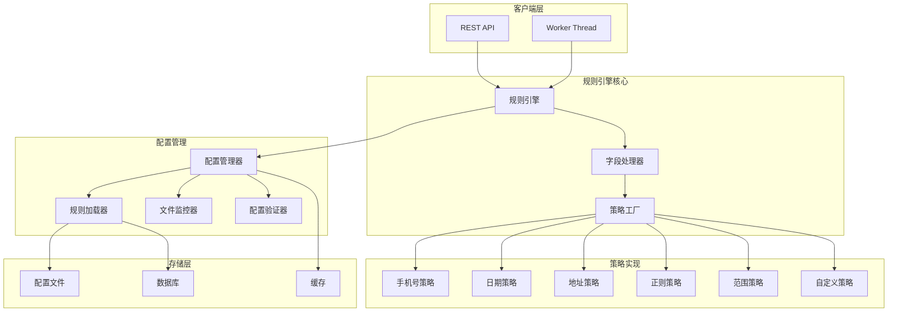
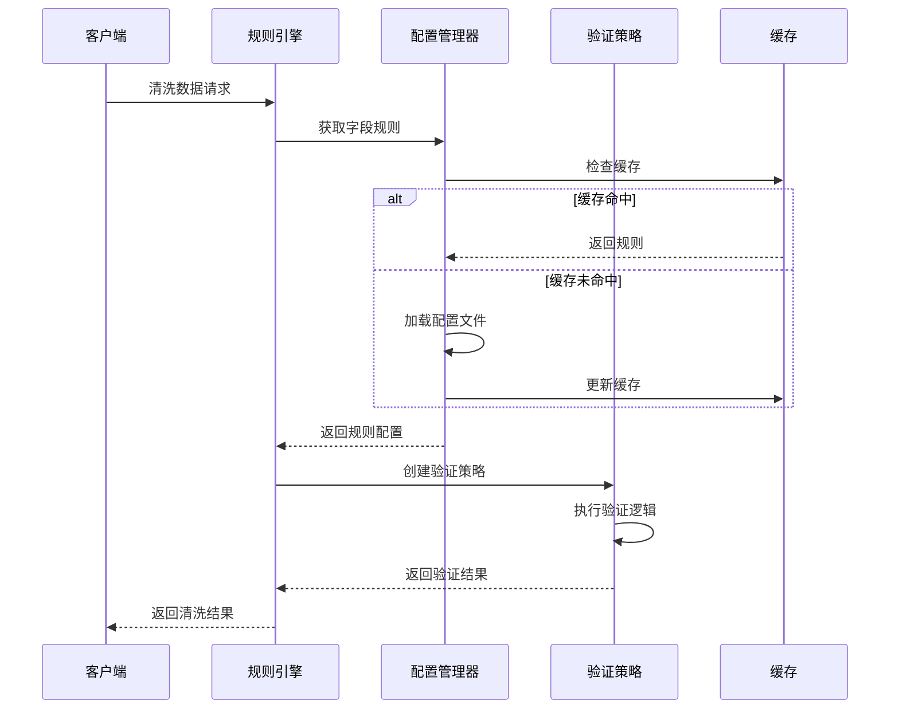

# 设计文档

## 概述

动态规则引擎将现有的硬编码数据清洗验证逻辑转换为基于配置的灵活系统。该系统采用策略模式架构，支持运行时规则修改而无需代码更改或服务重启。核心设计原则包括：

- **配置驱动**: 所有验证规则通过 JSON 配置定义
- **策略模式**: 使用策略模式消除硬编码的 if-else 链
- **热插拔**: 支持运行时配置更新和规则重载
- **向后兼容**: 保持与现有 API 和功能的完全兼容性
- **高性能**: 通过缓存和优化确保性能不受影响

## 架构

### 整体架构图



### 数据流图



## 组件和接口

### 核心接口定义

#### 验证策略接口

```typescript
interface ValidationStrategy<T = any> {
  /**
   * 策略名称，用于标识和注册
   */
  readonly name: string;
  
  /**
   * 策略描述
   */
  readonly description: string;
  
  /**
   * 执行验证逻辑
   * @param value 待验证的值
   * @param params 验证参数
   * @returns 验证结果
   */
  validate(value: any, params: ValidationParams): ValidationResult<T>;
  
  /**
   * 验证参数是否有效
   * @param params 验证参数
   * @returns 参数验证结果
   */
  validateParams(params: ValidationParams): boolean;
}
```

#### 规则配置接口

```typescript
interface RuleConfiguration {
  /**
   * 规则元数据
   */
  metadata: {
    name: string;
    description: string;
    version: string;
    priority: number;
  };
  
  /**
   * 字段规则映射
   */
  fieldRules: Record<string, FieldRule[]>;
  
  /**
   * 全局设置
   */
  globalSettings: {
    strictMode: boolean;
    continueOnError: boolean;
    maxErrors: number;
  };
}

interface FieldRule {
  /**
   * 规则名称
   */
  name: string;
  
  /**
   * 验证策略类型
   */
  strategy: string;
  
  /**
   * 验证参数
   */
  params: ValidationParams;
  
  /**
   * 是否必需
   */
  required: boolean;
  
  /**
   * 错误消息模板
   */
  errorMessage?: string;
  
  /**
   * 规则条件（可选）
   */
  condition?: RuleCondition;
}
```

#### 验证结果接口

```typescript
interface ValidationResult<T = any> {
  /**
   * 验证是否成功
   */
  success: boolean;
  
  /**
   * 清洗后的值
   */
  value?: T;
  
  /**
   * 错误信息
   */
  error?: string;
  
  /**
   * 错误代码
   */
  errorCode?: string;
  
  /**
   * 附加元数据
   */
  metadata?: Record<string, any>;
}
```

### 规则引擎核心类

#### RuleEngine 类

```typescript
@Injectable()
export class RuleEngine {
  constructor(
    private readonly configManager: ConfigurationManager,
    private readonly fieldProcessor: FieldProcessor,
    private readonly logger: Logger
  ) {}
  
  /**
   * 清洗单行数据
   */
  async cleanRow(
    rowData: Record<string, any>, 
    columnTypes: ColumnTypeMap
  ): Promise<CleaningResult> {
    // 实现逻辑
  }
  
  /**
   * 批量清洗数据
   */
  async cleanBatch(
    rows: Record<string, any>[], 
    columnTypes: ColumnTypeMap
  ): Promise<CleaningResult[]> {
    // 实现逻辑
  }
}
```

#### FieldProcessor 类

```typescript
@Injectable()
export class FieldProcessor {
  constructor(
    private readonly strategyFactory: StrategyFactory,
    private readonly configManager: ConfigurationManager
  ) {}
  
  /**
   * 处理单个字段
   */
  async processField(
    fieldName: string,
    value: any,
    columnType: ColumnType
  ): Promise<ValidationResult> {
    // 实现逻辑
  }
  
  /**
   * 获取字段规则
   */
  private getFieldRules(fieldName: string, columnType: ColumnType): FieldRule[] {
    // 实现逻辑
  }
}
```

#### StrategyFactory 类

```typescript
@Injectable()
export class StrategyFactory {
  private readonly strategies = new Map<string, ValidationStrategy>();
  
  /**
   * 注册验证策略
   */
  registerStrategy(strategy: ValidationStrategy): void {
    // 实现逻辑
  }
  
  /**
   * 创建验证策略实例
   */
  createStrategy(strategyName: string): ValidationStrategy {
    // 实现逻辑
  }
  
  /**
   * 获取所有可用策略
   */
  getAvailableStrategies(): string[] {
    // 实现逻辑
  }
}
```

### 配置管理组件

#### ConfigurationManager 类

```typescript
@Injectable()
export class ConfigurationManager {
  constructor(
    private readonly ruleLoader: RuleLoader,
    private readonly fileWatcher: FileWatcher,
    private readonly validator: ConfigValidator,
    private readonly cache: CacheService
  ) {}
  
  /**
   * 获取字段规则
   */
  getFieldRules(fieldName: string): FieldRule[] {
    // 实现逻辑
  }
  
  /**
   * 重载配置
   */
  async reloadConfiguration(): Promise<void> {
    // 实现逻辑
  }
  
  /**
   * 验证配置
   */
  async validateConfiguration(config: RuleConfiguration): Promise<ValidationResult> {
    // 实现逻辑
  }
}
```

#### RuleLoader 类

```typescript
@Injectable()
export class RuleLoader {
  /**
   * 从文件加载规则
   */
  async loadFromFile(filePath: string): Promise<RuleConfiguration> {
    // 实现逻辑
  }
  
  /**
   * 从数据库加载规则
   */
  async loadFromDatabase(): Promise<RuleConfiguration> {
    // 实现逻辑
  }
  
  /**
   * 从环境变量加载规则
   */
  loadFromEnvironment(): Partial<RuleConfiguration> {
    // 实现逻辑
  }
}
```

## 数据模型

### 配置文件结构

```json
{
  "metadata": {
    "name": "default-cleaning-rules",
    "description": "默认数据清洗规则配置",
    "version": "1.0.0",
    "priority": 100
  },
  "fieldRules": {
    "phone": [
      {
        "name": "chinese-mobile-validation",
        "strategy": "regex",
        "params": {
          "pattern": "^1[3-9]\\d{9}$",
          "flags": "i"
        },
        "required": true,
        "errorMessage": "手机号格式不正确，应为11位数字且以1开头"
      },
      {
        "name": "phone-format-cleanup",
        "strategy": "phone-cleaner",
        "params": {
          "removeSpaces": true,
          "removeDashes": true,
          "removeCountryCode": true
        },
        "required": false
      }
    ],
    "email": [
      {
        "name": "email-format-validation",
        "strategy": "regex",
        "params": {
          "pattern": "^[a-zA-Z0-9._%+-]+@[a-zA-Z0-9.-]+\\.[a-zA-Z]{2,}$"
        },
        "required": true,
        "errorMessage": "邮箱格式不正确"
      }
    ],
    "date": [
      {
        "name": "date-range-validation",
        "strategy": "date-range",
        "params": {
          "minYear": 1900,
          "maxYear": 2100,
          "formats": ["YYYY-MM-DD", "YYYY/MM/DD", "YYYY年MM月DD日"]
        },
        "required": true,
        "errorMessage": "日期格式不正确或超出有效范围"
      }
    ]
  },
  "globalSettings": {
    "strictMode": false,
    "continueOnError": true,
    "maxErrors": 10
  }
}
```

### 策略参数类型

```typescript
type ValidationParams = 
  | RegexParams 
  | RangeParams 
  | LengthParams 
  | PhoneParams 
  | DateParams 
  | AddressParams
  | CustomParams;

interface RegexParams {
  pattern: string;
  flags?: string;
  multiline?: boolean;
}

interface RangeParams {
  min?: number;
  max?: number;
  inclusive?: boolean;
}

interface LengthParams {
  minLength?: number;
  maxLength?: number;
  exactLength?: number;
}

interface PhoneParams {
  removeSpaces?: boolean;
  removeDashes?: boolean;
  removeCountryCode?: boolean;
  allowLandline?: boolean;
}

interface DateParams {
  formats?: string[];
  minYear?: number;
  maxYear?: number;
  timezone?: string;
}

interface AddressParams {
  requireProvince?: boolean;
  requireCity?: boolean;
  requireDistrict?: boolean;
  validateComponents?: boolean;
}

interface CustomParams {
  [key: string]: any;
}
```

## 错误处理

### 错误类型定义

```typescript
enum ValidationErrorType {
  INVALID_FORMAT = 'INVALID_FORMAT',
  OUT_OF_RANGE = 'OUT_OF_RANGE',
  REQUIRED_FIELD_MISSING = 'REQUIRED_FIELD_MISSING',
  STRATEGY_NOT_FOUND = 'STRATEGY_NOT_FOUND',
  CONFIGURATION_ERROR = 'CONFIGURATION_ERROR',
  PROCESSING_ERROR = 'PROCESSING_ERROR'
}

class ValidationError extends Error {
  constructor(
    public readonly type: ValidationErrorType,
    public readonly field: string,
    public readonly originalValue: any,
    message: string,
    public readonly metadata?: Record<string, any>
  ) {
    super(message);
    this.name = 'ValidationError';
  }
}
```

### 错误处理策略

1. **优雅降级**: 当规则执行失败时，记录错误但继续处理其他字段
2. **错误聚合**: 收集所有验证错误，提供完整的错误报告
3. **回退机制**: 当自定义规则失败时，回退到默认硬编码逻辑
4. **详细日志**: 记录详细的错误上下文，包括规则名称、字段名称和原始值

## 测试策略

### 单元测试

- **策略测试**: 测试每个验证策略的正确性和边界条件
- **配置测试**: 测试配置加载、验证和解析逻辑
- **引擎测试**: 测试规则引擎的核心逻辑和错误处理
- **集成测试**: 测试组件间的交互和数据流

### 正确性属性

*属性是一种特征或行为，应该在系统的所有有效执行中保持为真——本质上是关于系统应该做什么的正式声明。属性作为人类可读规范和机器可验证正确性保证之间的桥梁。*

基于预工作分析，以下属性验证系统在各种输入下的通用正确性。每个属性包含明确的"对于所有"声明，并引用其验证的需求。

#### 属性 1: 规则配置结构完整性
*对于任何* 有效的规则配置，它应当包含所有必需的字段（列名、验证类型、参数）以及适当的元数据（名称、描述、优先级）
**验证需求: 需求 1.1, 1.2, 1.3, 1.4, 1.6**

#### 属性 2: JSON 模式验证一致性
*对于任何* 规则配置输入，JSON 模式验证应当在加载时和运行时产生一致的验证结果
**验证需求: 需求 2.4, 6.1**

#### 属性 3: 策略选择和执行正确性
*对于任何* 字段和规则配置组合，字段处理器应当选择正确的验证策略并产生确定性的验证结果
**验证需求: 需求 3.1, 3.2**

#### 属性 4: 多规则逻辑组合正确性
*对于任何* 包含多个验证规则的字段配置，逻辑运算符（AND/OR）应当正确组合各个规则的结果
**验证需求: 需求 1.5, 3.5**

#### 属性 5: 错误处理鲁棒性
*对于任何* 无效的输入数据或配置错误，系统应当优雅地处理错误、记录详细信息并继续处理其他字段
**验证需求: 需求 2.2, 6.4, 6.5**

#### 属性 6: 配置验证完整性
*对于任何* 包含无效字段名或格式错误的正则表达式的配置，规则加载器应当检测并报告所有配置错误
**验证需求: 需求 6.2, 6.3**

#### 属性 7: 缓存一致性和性能优化
*对于任何* 重复的规则加载或策略实例化请求，缓存机制应当返回一致的结果并避免重复计算开销
**验证需求: 需求 2.5, 7.1**

#### 属性 8: 向后兼容性保证
*对于任何* 现有的数据清洗场景，新规则引擎应当产生与原硬编码逻辑相同的结果、API 响应格式和错误消息
**验证需求: 需求 5.1, 5.2, 5.3, 5.5**

#### 属性 9: 配置更新原子性
*对于任何* 配置更新操作，如果新规则无效，系统应当保留现有规则并提供详细的验证错误信息
**验证需求: 需求 4.3, 4.4**

#### 属性 10: 性能保持特性
*对于任何* 数据集，规则引擎的处理时间应当在硬编码版本的110%以内，并支持并行字段验证
**验证需求: 需求 7.2, 7.4**

#### 属性 11: API 响应一致性
*对于任何* 通过 API 进行的配置更新，系统应当返回包含验证结果和应用更改的一致响应格式
**验证需求: 需求 8.3**

#### 属性 12: 规则冲突检测
*对于任何* 包含可能产生不一致结果的冲突规则的配置，规则加载器应当检测并报告这些冲突
**验证需求: 需求 9.5**

#### 属性 13: 扩展性参数灵活性
*对于任何* 新的验证策略类型，规则配置应当能够通过灵活的参数结构支持其自定义参数
**验证需求: 需求 10.3**

### 性能测试

- **基准测试**: 与现有硬编码逻辑进行性能对比
- **负载测试**: 测试大数据集处理能力
- **内存测试**: 验证内存使用优化
- **并发测试**: 测试多线程环境下的性能表现

### 集成测试

- **API 测试**: 测试配置管理 API 的功能和安全性
- **文件监控测试**: 测试配置文件变更检测和自动重载
- **数据库集成测试**: 测试与现有数据库的集成
- **Worker 线程测试**: 测试在并行处理环境中的表现