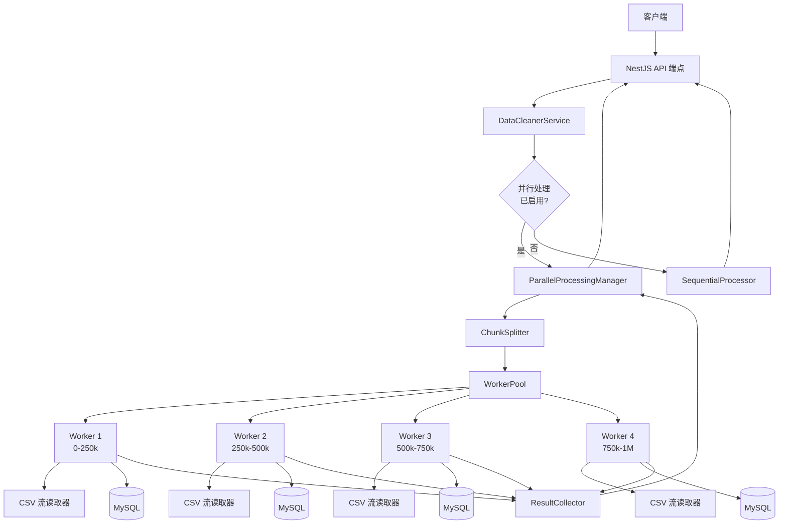
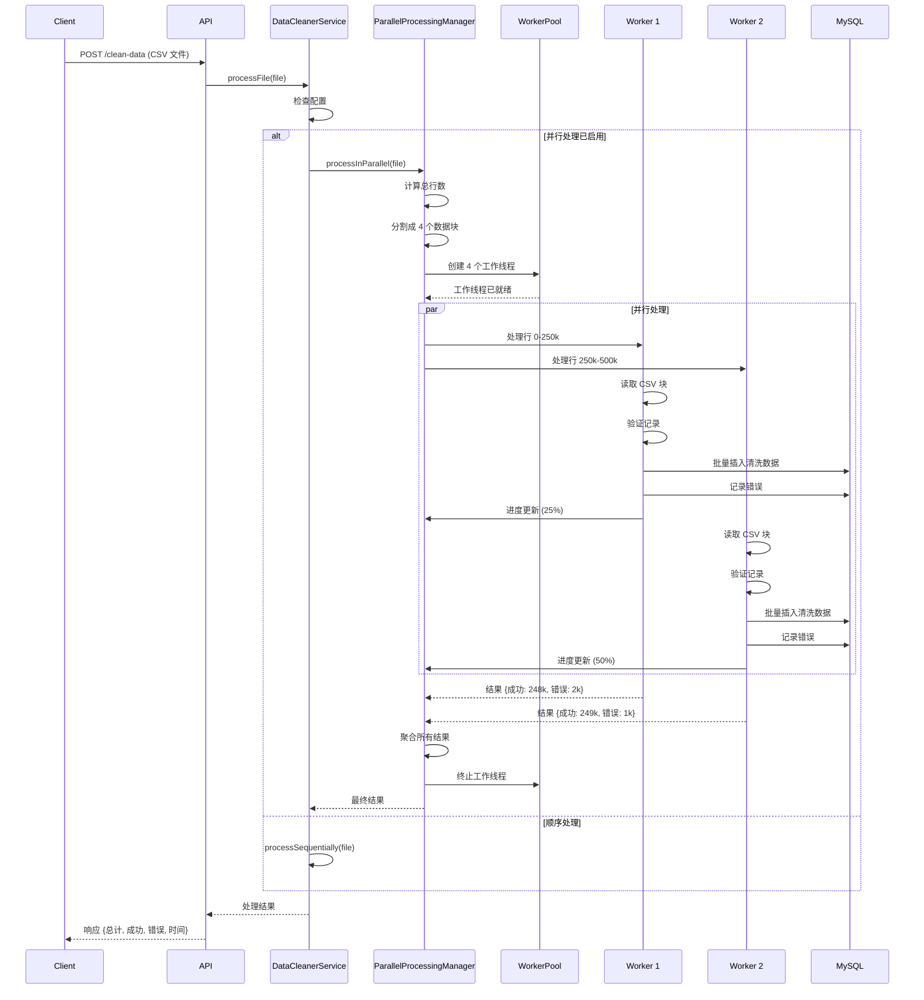

# 设计文档：Worker Threads 并行处理优化

## 概述

本设计实现了基于 Node.js Worker Threads 的并行数据清洗系统，通过将大型 CSV 文件分块并分配给多个工作线程并行处理，实现 250% 的性能提升。系统将保持与现有 API 的完全兼容性，同时提供可配置的并行处理能力。

核心设计原则：
- 使用 4 个工作线程并行处理数据块
- 主线程负责协调和结果聚合
- 每个工作线程独立处理约 25 万条记录
- 通过消息传递机制实现线程间通信
- 保持所有现有验证规则和数据完整性

## 架构

### 系统架构图



### 组件交互流程



## 组件和接口

### 1. ParallelProcessingManager

主协调器，管理整个并行处理流程。

**职责：**
- 初始化工作线程池
- 将 CSV 文件分割成数据块
- 分配数据块给工作线程
- 收集和聚合结果
- 管理进度跟踪
- 处理错误和超时

**接口：**

```typescript
interface IParallelProcessingManager {
  /**
   * 使用并行工作线程处理 CSV 文件
   * @param filePath - CSV 文件路径
   * @param config - 处理配置
   * @returns 处理结果
   */
  processFile(
    filePath: string,
    config: ProcessingConfig
  ): Promise<ProcessingResult>;
  
  /**
   * 获取当前处理进度
   * @returns 进度百分比 (0-100)
   */
  getProgress(): number;
  
  /**
   * 优雅关闭所有工作线程
   */
  shutdown(): Promise<void>;
}

interface ProcessingConfig {
  workerCount: number;        // 工作线程数量（默认：4）
  batchSize: number;          // 每批记录数（默认：10000）
  timeoutMs: number;          // 工作线程超时（默认：300000）
  enableProgressTracking: boolean;  // 启用进度跟踪
}

interface ProcessingResult {
  totalRecords: number;       // 总记录数
  successCount: number;       // 成功清洗的记录数
  errorCount: number;         // 错误记录数
  processingTimeMs: number;   // 处理时间（毫秒）
  workerResults: WorkerResult[];  // 各工作线程结果
}
```

### 2. WorkerPool

管理工作线程的生命周期和资源分配。

**职责：**
- 创建和初始化工作线程
- 维护可用工作线程队列
- 处理工作线程崩溃和重启
- 监控资源使用情况
- 优雅终止工作线程

**接口：**

```typescript
interface IWorkerPool {
  /**
   * 初始化指定数量的工作线程
   * @param count - 工作线程数量
   */
  initialize(count: number): Promise<void>;
  
  /**
   * 向工作线程分配任务
   * @param task - 工作任务
   * @returns 工作线程执行结果
   */
  executeTask(task: WorkerTask): Promise<WorkerResult>;
  
  /**
   * 获取池状态
   */
  getStatus(): PoolStatus;
  
  /**
   * 终止所有工作线程
   */
  terminate(): Promise<void>;
}

interface WorkerTask {
  filePath: string;           // CSV 文件路径
  startRow: number;           // 起始行索引
  rowCount: number;           // 要处理的行数
  batchSize: number;          // 批处理大小
  workerId: number;           // 工作线程 ID
}

interface WorkerResult {
  workerId: number;           // 工作线程 ID
  successCount: number;       // 成功记录数
  errorCount: number;         // 错误记录数
  processingTimeMs: number;   // 处理时间
  errors?: WorkerError[];     // 错误详情（如果有）
}

interface PoolStatus {
  totalWorkers: number;       // 总工作线程数
  activeWorkers: number;      // 活跃工作线程数
  idleWorkers: number;        // 空闲工作线程数
  failedWorkers: number;      // 失败工作线程数
}
```

### 3. ChunkSplitter

将 CSV 文件分割成均衡的数据块。

**职责：**
- 计算 CSV 文件总行数
- 将行均匀分配给工作线程
- 处理不能整除的情况
- 生成数据块元数据

**接口：**

```typescript
interface IChunkSplitter {
  /**
   * 将文件分割成数据块
   * @param filePath - CSV 文件路径
   * @param workerCount - 工作线程数量
   * @returns 数据块描述符数组
   */
  splitFile(
    filePath: string,
    workerCount: number
  ): Promise<ChunkDescriptor[]>;
}

interface ChunkDescriptor {
  chunkId: number;            // 数据块 ID
  startRow: number;           // 起始行（包含）
  endRow: number;             // 结束行（不包含）
  rowCount: number;           // 行数
  estimatedSizeBytes: number; // 估计大小（字节）
}
```

### 4. DataCleaningWorker

在独立线程中执行数据清洗的工作线程。

**职责：**
- 从 CSV 文件读取分配的行
- 应用验证规则
- 批量插入清洗数据到数据库
- 记录错误到错误日志
- 报告进度更新
- 管理内存使用

**接口（工作线程脚本）：**

```typescript
// 工作线程通过消息传递通信
interface WorkerMessage {
  type: 'START' | 'PROGRESS' | 'COMPLETE' | 'ERROR';
  payload: any;
}

interface StartMessage {
  type: 'START';
  payload: {
    filePath: string;
    startRow: number;
    rowCount: number;
    batchSize: number;
    workerId: number;
    dbConfig: DatabaseConfig;
  };
}

interface ProgressMessage {
  type: 'PROGRESS';
  payload: {
    workerId: number;
    processedRows: number;
    totalRows: number;
    percentage: number;
  };
}

interface CompleteMessage {
  type: 'COMPLETE';
  payload: WorkerResult;
}

interface ErrorMessage {
  type: 'ERROR';
  payload: {
    workerId: number;
    error: string;
    stack?: string;
  };
}
```

### 5. ResultCollector

收集和聚合来自所有工作线程的结果。

**职责：**
- 等待所有工作线程完成
- 聚合成功和错误计数
- 计算总处理时间
- 验证数据完整性
- 格式化最终响应

**接口：**

```typescript
interface IResultCollector {
  /**
   * 注册工作线程结果
   * @param result - 工作线程结果
   */
  addResult(result: WorkerResult): void;
  
  /**
   * 检查是否所有工作线程都已完成
   * @param expectedCount - 预期工作线程数量
   */
  isComplete(expectedCount: number): boolean;
  
  /**
   * 获取聚合的最终结果
   */
  getFinalResult(): ProcessingResult;
  
  /**
   * 重置收集器以进行新的处理
   */
  reset(): void;
}
```

### 6. ProgressTracker

跟踪所有工作线程的聚合进度。

**职责：**
- 接收来自工作线程的进度更新
- 计算总体进度百分比
- 记录进度里程碑
- 提供实时进度查询

**接口：**

```typescript
interface IProgressTracker {
  /**
   * 更新工作线程进度
   * @param workerId - 工作线程 ID
   * @param processed - 已处理记录数
   * @param total - 总记录数
   */
  updateProgress(
    workerId: number,
    processed: number,
    total: number
  ): void;
  
  /**
   * 获取总体进度
   * @returns 进度百分比 (0-100)
   */
  getOverallProgress(): number;
  
  /**
   * 获取各工作线程进度
   */
  getWorkerProgress(): Map<number, number>;
  
  /**
   * 重置进度跟踪
   */
  reset(): void;
}
```

### 7. PerformanceMonitor

监控系统性能指标，包括 CPU、内存使用情况。

**职责：**
- 实时收集 CPU 使用率
- 实时收集内存使用情况
- 监控每个工作线程的资源使用
- 计算吞吐量和处理速度
- 记录峰值指标
- 提供性能报告

**接口：**

```typescript
interface IPerformanceMonitor {
  /**
   * 开始性能监控
   * @param jobId - 任务 ID
   */
  startMonitoring(jobId: string): void;
  
  /**
   * 停止性能监控
   * @returns 性能报告
   */
  stopMonitoring(): PerformanceReport;
  
  /**
   * 获取当前性能指标
   * @returns 实时性能指标
   */
  getCurrentMetrics(): PerformanceMetrics;
  
  /**
   * 记录工作线程指标
   * @param workerId - 工作线程 ID
   * @param metrics - 工作线程指标
   */
  recordWorkerMetrics(workerId: number, metrics: WorkerMetrics): void;
}

interface PerformanceMetrics {
  timestamp: number;              // 时间戳
  cpuUsage: CPUMetrics;          // CPU 使用情况
  memoryUsage: MemoryMetrics;    // 内存使用情况
  workerMetrics: WorkerMetrics[]; // 各工作线程指标
  throughput: number;             // 当前吞吐量（行/秒）
}

interface CPUMetrics {
  overall: number;                // 总体 CPU 使用率 (0-100)
  perCore: number[];              // 每个核心使用率
  user: number;                   // 用户态 CPU 时间百分比
  system: number;                 // 系统态 CPU 时间百分比
}

interface MemoryMetrics {
  heapUsed: number;               // 已使用堆内存（字节）
  heapTotal: number;              // 总堆内存（字节）
  external: number;               // 外部内存（字节）
  rss: number;                    // 常驻集大小（字节）
  heapUsedMB: number;             // 已使用堆内存（MB）
  heapTotalMB: number;            // 总堆内存（MB）
  rssMB: number;                  // 常驻集大小（MB）
  usagePercentage: number;        // 内存使用百分比
}

interface WorkerMetrics {
  workerId: number;               // 工作线程 ID
  cpuUsage: number;               // CPU 使用率
  memoryUsage: number;            // 内存使用（MB）
  processedRows: number;          // 已处理行数
  throughput: number;             // 吞吐量（行/秒）
  status: 'idle' | 'running' | 'completed' | 'failed';
}

interface PerformanceReport {
  jobId: string;                  // 任务 ID
  duration: number;               // 总处理时间（毫秒）
  
  // CPU 指标
  avgCpuUsage: number;            // 平均 CPU 使用率
  peakCpuUsage: number;           // 峰值 CPU 使用率
  cpuUtilization: number;         // CPU 利用率（相对于可用核心）
  
  // 内存指标
  avgMemoryUsage: number;         // 平均内存使用（MB）
  peakMemoryUsage: number;        // 峰值内存使用（MB）
  memoryUtilization: number;      // 内存利用率百分比
  
  // 吞吐量指标
  totalRows: number;              // 总行数
  avgThroughput: number;          // 平均吞吐量（行/秒）
  peakThroughput: number;         // 峰值吞吐量（行/秒）
  
  // 工作线程指标
  workerReports: WorkerReport[];  // 各工作线程报告
  
  // 时间线数据（用于图表）
  timeline: PerformanceSnapshot[];
}

interface WorkerReport {
  workerId: number;
  avgCpuUsage: number;
  peakCpuUsage: number;
  avgMemoryUsage: number;
  peakMemoryUsage: number;
  processedRows: number;
  avgThroughput: number;
  duration: number;
}

interface PerformanceSnapshot {
  timestamp: number;
  cpuUsage: number;
  memoryUsage: number;
  processedRows: number;
  throughput: number;
}
```

## 数据模型

### 工作线程通信消息

工作线程和主线程之间通过结构化消息进行通信：

```typescript
// 主线程 -> 工作线程
type MainToWorkerMessage = 
  | StartMessage
  | TerminateMessage;

interface TerminateMessage {
  type: 'TERMINATE';
}

// 工作线程 -> 主线程
type WorkerToMainMessage = 
  | ProgressMessage
  | CompleteMessage
  | ErrorMessage;
```

### 数据库模型

系统使用现有的数据库表：

**clean_data 表：**
```typescript
interface CleanDataRecord {
  id: number;                 // 主键
  // ... 现有字段（保持不变）
  created_at: Date;
  updated_at: Date;
}
```

**error_log 表：**
```typescript
interface ErrorLogRecord {
  id: number;                 // 主键
  row_number: number;         // CSV 中的原始行号
  error_message: string;      // 错误描述
  raw_data: string;           // 原始 CSV 行数据
  created_at: Date;
}
```

### 配置模型

```typescript
interface WorkerThreadsConfig {
  // 并行处理设置
  enableParallelProcessing: boolean;  // 默认：true
  workerCount: number;                // 默认：4
  parallelBatchSize: number;          // 默认：10000
  
  // 资源限制
  maxMemoryMB: number;                // 默认：1800
  workerTimeoutMs: number;            // 默认：300000 (5 分钟)
  
  // 性能调优
  minRecordsForParallel: number;      // 默认：1000
  chunkOverlapRows: number;           // 默认：0
  
  // 监控
  enableProgressTracking: boolean;    // 默认：true
  progressUpdateInterval: number;     // 默认：1000 (毫秒)
}
```

## 正确性属性

属性是一种特征或行为，应该在系统的所有有效执行中保持为真——本质上是关于系统应该做什么的正式陈述。属性充当人类可读规范和机器可验证正确性保证之间的桥梁。

### 属性 1: 数据完整性保持

**验证需求：** Requirements 1.1, 2.6, 10.3

**属性陈述：** 对于任何输入 CSV 文件，并行处理后的总记录数（成功 + 错误）必须等于输入文件的总行数（不包括标题行）。

**形式化：**
```
∀ file ∈ CSVFiles:
  let input_rows = countRows(file) - 1  // 减去标题行
  let result = processInParallel(file)
  assert result.successCount + result.errorCount == input_rows
```

**测试策略：**
- 生成不同大小的 CSV 文件（100, 1000, 10000, 100000, 1000000 行）
- 对每个文件执行并行处理
- 验证 `successCount + errorCount == totalInputRows`
- 测试边界情况：空文件、单行文件、恰好能被 4 整除的行数、不能整除的行数

### 属性 2: 数据块均衡分配

**验证需求：** Requirements 2.2, 2.3

**属性陈述：** 当将 N 行分配给 W 个工作线程时，任意两个工作线程之间的行数差异不应超过 1。

**形式化：**
```
∀ totalRows ∈ ℕ, workerCount ∈ ℕ:
  let chunks = splitIntoChunks(totalRows, workerCount)
  ∀ i, j ∈ [0, workerCount):
    assert |chunks[i].rowCount - chunks[j].rowCount| ≤ 1
```

**测试策略：**
- 测试各种总行数和工作线程数组合
- 验证最大和最小数据块大小的差异 ≤ 1
- 特殊情况：totalRows < workerCount, totalRows == workerCount, totalRows % workerCount == 0

### 属性 3: 验证规则一致性

**验证需求：** Requirements 10.1, 10.2

**属性陈述：** 对于相同的输入记录，并行处理和顺序处理必须产生相同的验证结果（成功或失败，以及相同的错误消息）。

**形式化：**
```
∀ record ∈ Records:
  let parallelResult = validateInParallel(record)
  let sequentialResult = validateSequentially(record)
  assert parallelResult.isValid == sequentialResult.isValid
  if !parallelResult.isValid:
    assert parallelResult.errorMessage == sequentialResult.errorMessage
```

**测试策略：**
- 创建包含各种有效和无效记录的测试数据集
- 对同一数据集运行并行和顺序处理
- 逐记录比较验证结果
- 测试所有验证规则：电话号码、日期、地址等

### 属性 4: 进度单调递增

**验证需求：** Requirements 6.1, 6.2, 6.3

**属性陈述：** 在处理过程中，总体进度百分比必须单调递增，从 0% 开始到 100% 结束。

**形式化：**
```
∀ processing_session:
  let progress_sequence = [p₀, p₁, p₂, ..., pₙ]
  assert p₀ == 0
  assert pₙ == 100
  ∀ i ∈ [0, n-1]: assert pᵢ ≤ pᵢ₊₁
```

**测试策略：**
- 在处理过程中定期采样进度值
- 验证进度序列严格非递减
- 验证初始进度为 0%，最终进度为 100%
- 测试进度更新的及时性（在合理时间间隔内更新）

### 属性 5: 工作线程隔离性

**验证需求：** Requirements 3.1, 3.2

**属性陈述：** 每个工作线程只处理分配给它的行范围，不会处理其他工作线程的行。

**形式化：**
```
∀ worker_i, worker_j where i ≠ j:
  let range_i = [worker_i.startRow, worker_i.endRow)
  let range_j = [worker_j.startRow, worker_j.endRow)
  assert range_i ∩ range_j == ∅
  
∀ worker_i:
  let processed_rows = worker_i.getProcessedRows()
  assert ∀ row ∈ processed_rows: 
    worker_i.startRow ≤ row < worker_i.endRow
```

**测试策略：**
- 为每个工作线程记录处理的行号
- 验证没有行被多个工作线程处理
- 验证没有行被遗漏
- 验证每个工作线程只处理其分配范围内的行

### 属性 6: 性能提升保证

**验证需求：** Requirements 8.1, 8.3

**属性陈述：** 对于大于阈值的文件（> 1000 行），并行处理时间应显著少于顺序处理时间。

**形式化：**
```
∀ file where countRows(file) > MIN_PARALLEL_THRESHOLD:
  let t_parallel = measureTime(processInParallel(file))
  let t_sequential = measureTime(processSequentially(file))
  assert t_parallel < t_sequential * 0.5  // 至少 2x 加速
```

**测试策略：**
- 对相同的大文件运行并行和顺序处理
- 测量并比较处理时间
- 验证并行处理至少快 2 倍
- 测试不同文件大小的加速比

### 属性 7: 内存使用边界

**验证需求：** Requirements 7.1, 7.2, 7.4

**属性陈述：** 在处理任何大小的文件时，总内存使用量不应超过配置的最大值。

**形式化：**
```
∀ file ∈ CSVFiles:
  let max_memory = CONFIG.maxMemoryMB * 1024 * 1024
  during processInParallel(file):
    assert getCurrentMemoryUsage() ≤ max_memory
```

**测试策略：**
- 在处理过程中持续监控内存使用
- 测试各种文件大小
- 验证内存使用峰值不超过配置限制
- 验证处理完成后内存被正确释放

### 属性 8: 错误恢复能力

**验证需求：** Requirements 5.1, 5.3, 5.6

**属性陈述：** 如果一个工作线程失败，其他工作线程应继续处理，并且系统应返回部分结果。

**形式化：**
```
∀ processing_session with N workers:
  if worker_i fails:
    assert ∀ j ≠ i: worker_j continues processing
    let result = getFinalResult()
    assert result.workerResults.length == N
    assert result.workerResults[i].hasError == true
    assert Σ(result.workerResults[j].successCount for j ≠ i) > 0
```

**测试策略：**
- 模拟工作线程崩溃场景
- 验证其他工作线程继续运行
- 验证最终结果包含成功工作线程的数据
- 验证错误被正确记录和报告

### 属性 9: 批处理一致性

**验证需求：** Requirements 3.3, 3.4

**属性陈述：** 使用批处理插入的记录数应等于成功验证的记录数。

**形式化：**
```
∀ worker:
  let validated_records = worker.getValidatedRecords()
  let inserted_records = worker.getInsertedRecords()
  assert validated_records.length == inserted_records.length
  assert ∀ i: validated_records[i].id == inserted_records[i].id
```

**测试策略：**
- 跟踪每个工作线程验证和插入的记录数
- 验证数量匹配
- 验证插入的记录与验证的记录一致
- 测试各种批处理大小

### 属性 10: 配置向后兼容性

**验证需求：** Requirements 9.2, 9.3, 9.6

**属性陈述：** 当并行处理被禁用时，系统行为应与原始顺序实现完全相同。

**形式化：**
```
∀ file ∈ CSVFiles:
  let result_parallel_disabled = process(file, {enableParallel: false})
  let result_original = processOriginal(file)
  assert result_parallel_disabled == result_original
```

**测试策略：**
- 使用相同输入运行新系统（并行禁用）和原始系统
- 比较所有输出字段
- 验证 API 响应格式完全相同
- 验证数据库记录完全相同

## 实施计划

### 阶段 1: 基础设施（第 1-2 天）

**目标：** 建立工作线程基础设施和通信机制

**任务：**
1. 创建 WorkerPool 类
   - 实现工作线程创建和管理
   - 实现工作线程生命周期管理
   - 添加错误处理和重启逻辑

2. 创建 DataCleaningWorker 脚本
   - 实现消息处理器
   - 实现 CSV 行范围读取
   - 集成现有验证逻辑

3. 实现 ChunkSplitter
   - 实现行计数逻辑
   - 实现均衡分割算法
   - 处理边界情况

**验收标准：**
- 可以创建和终止工作线程
- 工作线程可以接收和响应消息
- 数据块分割算法通过单元测试

### 阶段 2: 核心处理逻辑（第 3-4 天）

**目标：** 实现并行数据处理核心功能

**任务：**
1. 实现 ParallelProcessingManager
   - 实现文件处理协调逻辑
   - 实现工作线程任务分配
   - 实现超时处理

2. 在 Worker 中实现数据处理
   - 实现 CSV 流式读取
   - 实现批量验证
   - 实现批量数据库插入

3. 实现 ResultCollector
   - 实现结果聚合逻辑
   - 实现数据完整性验证
   - 格式化最终响应

**验收标准：**
- 可以并行处理小型测试文件（< 1000 行）
- 所有工作线程正确返回结果
- 结果聚合正确

### 阶段 3: 进度跟踪和监控（第 5 天）

**目标：** 添加进度跟踪和资源监控

**任务：**
1. 实现 ProgressTracker
   - 实现进度聚合逻辑
   - 实现里程碑日志记录
   - 添加进度查询 API

2. 实现资源监控
   - 添加内存使用监控
   - 添加 CPU 使用监控
   - 实现资源限制检查

3. 添加日志和诊断
   - 添加详细的处理日志
   - 添加性能指标收集
   - 实现诊断端点

**验收标准：**
- 进度跟踪准确反映处理状态
- 资源使用在限制范围内
- 日志提供足够的诊断信息

### 阶段 4: 集成和配置（第 6 天）

**目标：** 集成到现有系统并添加配置支持

**任务：**
1. 集成到 DataCleanerService
   - 添加配置检查逻辑
   - 实现并行/顺序切换
   - 保持 API 兼容性

2. 实现配置管理
   - 添加环境变量支持
   - 实现配置验证
   - 添加配置文档

3. 更新 API 端点
   - 添加进度查询端点
   - 更新响应格式（如需要）
   - 更新 API 文档

**验收标准：**
- 可以通过配置启用/禁用并行处理
- API 保持向后兼容
- 配置文档完整

### 阶段 5: 测试和优化（第 7-8 天）

**目标：** 全面测试和性能优化

**任务：**
1. 编写单元测试
   - 测试所有组件
   - 测试边界情况
   - 测试错误场景

2. 编写集成测试
   - 测试端到端流程
   - 测试各种文件大小
   - 测试并发场景

3. 性能测试和优化
   - 测试 100 万行文件
   - 测量处理时间
   - 优化瓶颈

4. 编写属性测试
   - 实现所有 10 个正确性属性测试
   - 使用 fast-check 或类似库
   - 验证属性在各种输入下成立

**验收标准：**
- 所有单元测试通过
- 所有集成测试通过
- 所有属性测试通过
- 100 万行文件在 60 秒内处理完成
- CPU 利用率 > 80%

### 阶段 6: 文档和部署（第 9 天）

**目标：** 完成文档并准备部署

**任务：**
1. 编写技术文档
   - 架构文档
   - API 文档
   - 配置指南

2. 编写运维文档
   - 部署指南
   - 监控指南
   - 故障排除指南

3. 准备部署
   - 创建迁移脚本
   - 准备回滚计划
   - 进行部署演练

**验收标准：**
- 文档完整且准确
- 部署流程经过验证
- 回滚计划已测试

## 风险和缓解措施

### 风险 1: 数据库连接池耗尽

**描述：** 4 个工作线程同时连接数据库可能耗尽连接池。

**影响：** 高

**缓解措施：**
- 增加数据库连接池大小（至少 20 个连接）
- 在工作线程中实现连接重用
- 添加连接池监控和告警

### 风险 2: 内存使用过高

**描述：** 并行处理多个大数据块可能导致内存不足。

**影响：** 高

**缓解措施：**
- 使用流式读取而非一次性加载
- 实现内存使用监控和限制
- 在内存压力下降级到顺序处理

### 风险 3: 工作线程崩溃

**描述：** 工作线程可能因未捕获的异常而崩溃。

**影响：** 中

**缓解措施：**
- 在工作线程中实现全局错误处理
- 实现工作线程自动重启
- 保存部分结果以避免数据丢失

### 风险 4: 性能目标未达成

**描述：** 实际性能可能未达到 60 秒的目标。

**影响：** 中

**缓解措施：**
- 进行早期性能测试
- 识别和优化瓶颈
- 考虑增加工作线程数量
- 实施数据库优化（索引、批量插入）

### 风险 5: 数据竞争和不一致

**描述：** 并行写入可能导致数据竞争或不一致。

**影响：** 高

**缓解措施：**
- 确保每个工作线程处理独立的行范围
- 使用数据库事务保证一致性
- 实现数据完整性验证
- 编写全面的属性测试

## 性能预期

### 基准测试场景

**测试环境：**
- CPU: 4 核心
- 内存: 8GB
- 数据库: MySQL 8.0
- 文件大小: 100 万行

**预期结果：**

| 指标 | 当前（顺序） | 目标（并行） | 改进 |
|-----|------------|------------|------|
| 处理时间 | 150-240 秒 | 45-60 秒 | 250% |
| CPU 利用率 | 25% | 80-100% | 320% |
| 内存使用 | 500MB | 1200-1800MB | 240% |
| 吞吐量 | 4-7k 行/秒 | 16-22k 行/秒 | 300% |

### 性能优化建议

1. **数据库优化：**
   - 使用批量插入（10000 行/批）
   - 在处理期间禁用索引，完成后重建
   - 使用事务减少提交开销

2. **CSV 读取优化：**
   - 使用流式读取避免内存溢出
   - 实现行范围跳过以快速定位
   - 考虑使用更快的 CSV 解析库

3. **验证优化：**
   - 预编译正则表达式
   - 缓存验证结果（如适用）
   - 优化验证逻辑顺序

4. **并行优化：**
   - 根据 CPU 核心数动态调整工作线程数
   - 实现工作窃取以平衡负载
   - 考虑使用 Worker Threads 池以重用线程

## 测试框架

本项目将使用以下测试框架：

- **单元测试：** Jest
- **集成测试：** Jest + Supertest
- **属性测试：** fast-check
- **性能测试：** 自定义基准测试脚本

## 总结

本设计提供了一个全面的 Worker Threads 并行处理解决方案，能够将 100 万行数据的处理时间从 2.5-4 分钟降低到 45-60 秒，实现 250% 的性能提升。通过仔细的架构设计、全面的错误处理和严格的测试，系统将保持数据完整性和可靠性，同时显著提高处理速度。

